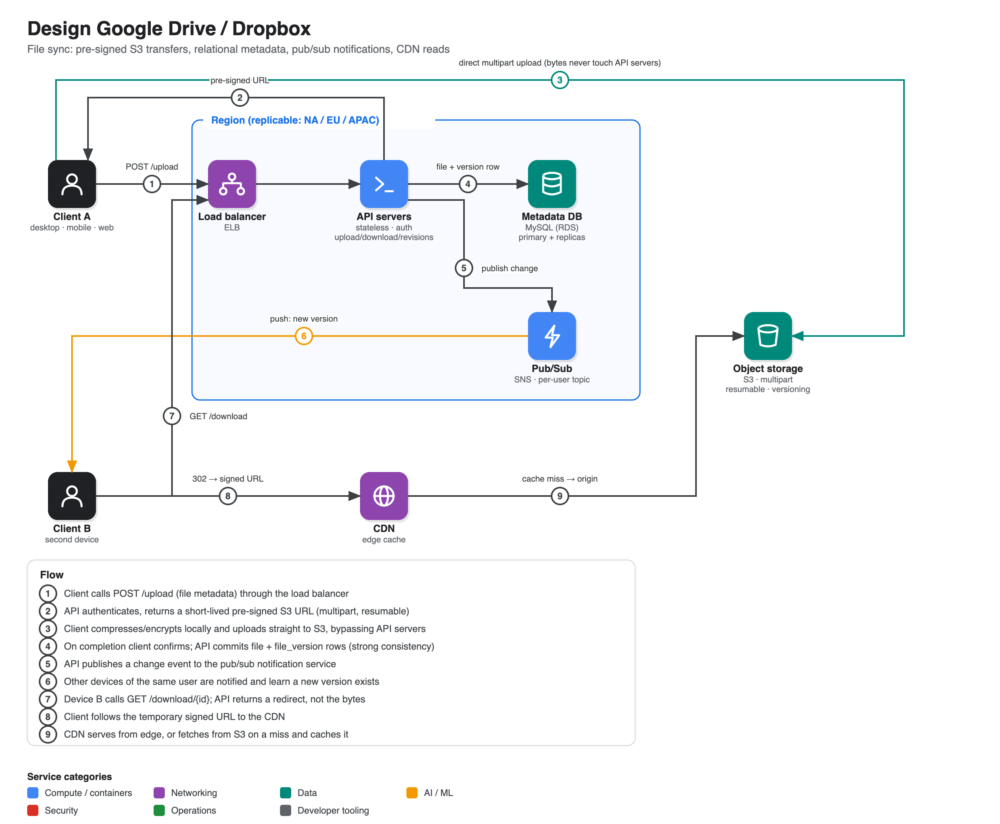

# Design Google Drive / Dropbox

**Source:** [Design file-sharing system like Google Drive / Dropbox](https://www.youtube.com/watch?v=4_qu1F9BXow) · IGotAnOffer: Engineering · 48 min
**Interviewee:** Alex, ex-Shopify engineering manager (10 years)

## Scope

| | |
|---|---|
| **In** | upload, download, sync across devices, change notifications |
| **Out** | previews/thumbnails, in-app editing, sharing links, version history/restore |
| **Clients** | mobile, web, desktop |
| **Non-functional** | simplicity, trust (never lose data), high availability, fast, low bandwidth |

## Back-of-envelope numbers

- 100M signed-up users, 1M DAU, 1 file/day each, 5 MB average, 10 GB max file, 15 GB quota per user.
- Storage ≈ 100M × 15 GB ≈ **1.5 PB** worst case.
- ~1M uploads/day ≈ **11 QPS**, peak ≈ 20 QPS. Traffic ≈ 5 TB/day.
- Takeaway: nothing exotic. The design is driven by *file size and trust*, not request rate.

## API

| Endpoint | Behaviour |
|---|---|
| `POST /upload` | Resumable (S3 multipart). Returns a pre-signed URL; the client sends bytes straight to S3. |
| `GET /download/{file_id}` | Returns a **redirect** to a temporary signed URL, so API servers never stream file bytes. |
| `GET /revisions/{file_id}` | List of changes + timestamps so a long-offline client can reconcile. |

## Components and why

- **Client does the heavy lifting**: talks to S3 directly, handles login/credentials, **compresses** (spends cheap local CPU instead of expensive bandwidth; tunable per device, e.g. battery on phones) and can **encrypt client-side**.
- **Load balancer + stateless API servers**: application logic only; scale horizontally.
- **S3** for blobs: resumable multipart uploads, signed temporary URLs, built-in versioning, familiar to every engineer (no training cost).
- **MySQL on RDS** for metadata: consistency over availability (CAP), simple, widely known.
- **Pub/sub (SNS)**: API publishes a change; other devices of that user get a notification and then pull.

### Schema

| Table | Fields |
|---|---|
| `user` | id (**bigint**, avoids the "YouTube integer overflow" problem), email, password_hash, last_sign_in |
| `file` | id, path, file_hash, owner_id, is_folder, created/updated |
| `file_version` | id, file_id, version |
| `device` | id, user_id (needed to know *which* device is out of sync) |

## Flows

1. **Upload:** client → LB → API → pre-signed URL → client uploads to S3 → client confirms → API writes metadata → API publishes to pub/sub.
2. **Sync/download:** pub/sub notifies other devices → device calls the API → gets a redirect → downloads from CDN/S3.

## Deep-dive improvements discussed

- **Regionalise**: treat everything except S3/CDN as a box that can be duplicated per region. Gives lower latency and a failover target; S3 and CDN are already global.
- **S3 key prefixes**: S3 partitions hot prefixes in the background and can throw errors while it does. Put a short random string before the user id to spread keys.
- **CDN in front of S3** for read-heavy and shared files; cheaper and regionally faster.
- **Versioning**: S3 offers it almost for free, so a paid "restore old versions" tier is cheap to add.
- **Database HA**: primary + standby + read replicas; separate read path (replicas + metadata service + CDN) from the write path since read traffic dominates.
- **Folders**: add an `is_folder` flag; a path alone is ambiguous.
- **Conflicts**: two devices upload the same filename at once. Never drop either; keep both, with a timestamp suffix on the loser.

## Interview technique called out in the video

- Do not stall on requirements. Of ten numbers you could ask, only two or three shape the design (DAU, files/day, file size). Ask "anything else before I move on?" and let the interviewer steer.
- Start with the simplest end-to-end flow (client → LB → API → storage) and let that flow dictate the next component.
- Justify every component (e.g. "S3 because it's common, supports multipart and signed URLs").
- Start the deep dive around minute 15.
- It is fine to say "I haven't used X, my understanding is Y." Over-claiming hurts more.
- Wrapping boxes in a "region" is a cheap way to show scalability without redrawing the diagram.
