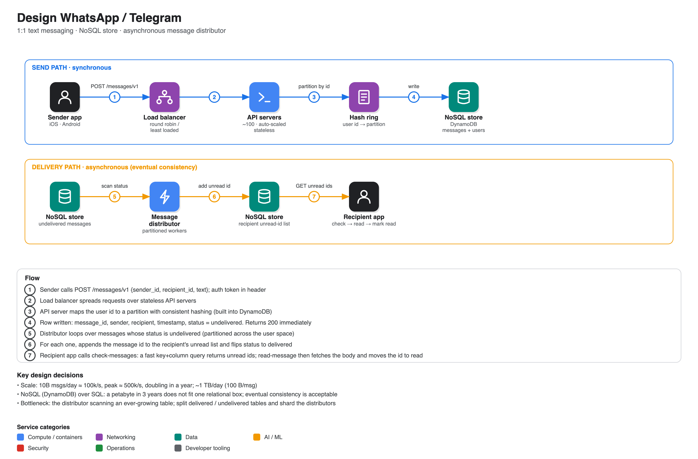

# Design WhatsApp / Telegram

**Source:** [System design mock interview: "Design WhatsApp or Telegram"](https://www.youtube.com/watch?v=M6UZ7pVD-rQ) · IGotAnOffer: Engineering · 52 min
**Interviewee:** Mark, ex-Google engineering manager (13 years)

## Scope

| | |
|---|---|
| **In** | send a message, check for new messages, read a message, mark as read. One-to-one text only. |
| **Out** | groups, media, presence. Entry point is the API, not the mobile UI. |
| **Scale** | 10B messages sent/day, doubling within a year |
| **Latency** | hundreds of ms at p90/p95, not just the average |
| **Availability** | always on |
| **Consistency** | **eventual is fine**: the recipient seeing it a second or two later is acceptable |

## Capacity estimate

- 10B/day ÷ ~100k s/day ≈ **100k msg/s**, peak ≈ **500k/s**, doubling to ~1M/s.
- ~10k req/s per server → ~50 API servers for sends, ~100 once reads are included, with auto-scaling.
- 100 B per text message → ~**1 TB/day**, ~365 TB/year, ~**1 PB in 3 years**.

## API (REST)

| Call | Notes |
|---|---|
| `POST /messages/v1` `{sender_id, recipient_id, text}` | 200 on success, 4xx on error; auth token in the header so senders cannot be forged |
| `GET /messages/v1` | list of unread message ids for the caller |
| `GET /messages/v1?message_id=…` | fetch one message |
| mark-read | moves an id from unread to read |

## Components and why

- **Load balancer** (round robin or least-loaded) in front of stateless **API servers**.
- **NoSQL store (DynamoDB)**. A relational DB cannot hold a petabyte on one box and the requirement tolerates eventual consistency. Hosted DynamoDB was chosen because engineer time costs more than infrastructure at the start. Cassandra/MongoDB self-hosted may become cheaper at scale.
- **Consistent hashing** maps a user id to a partition (users are bucketed over N backends). DynamoDB does this internally; named in case a self-run store is needed.
- **Message distributor**: a background job that finds `undelivered` messages and fans them into each recipient's unread list. This is what removes the need for the sender to wait for the recipient.

### Data model

| Table | Fields |
|---|---|
| `messages` | partition key sender/recipient, range key `message_id` (ever-increasing), timestamp, recipient_id, status |
| `users` | user_id, metadata (name, phone), `sent_message_ids`, `unread_message_ids`, `read_message_ids` |

Keeping `unread_message_ids` on the user row makes "check messages" a fast column query rather than a scan.

## Bottleneck called out

The distributor has to scan an ever-growing message table. Fixes discussed:

- split into **undelivered** and **delivered** tables (the interviewer's feedback singled this out as a good answer),
- or use a DB-level filtered/indexed query,
- run **many distributors partitioned by user space** so one failing does not stop delivery.

Hand-waved and flagged: locking/contention between distributors, and group delivery status (needs more than a single status field).

## Operations

Track average **and** p90/p95 latency, plus availability measured in nines.

## Interview technique called out in the video

- Cut scope early (groups out) and reach a working solution before scaling it out.
- Quick maths only: daily → per-second → bytes, then move on.
- Volunteer the reasoning behind a technology choice (the coach noted Mark should have given the DynamoDB justification without being asked).
- A short detour on load-balancing strategies / consistent hashing is fine; do not spend long on it.
- Use the last minutes to refine: Mark touched on groups, and could have earned more by returning to the locking issue.
