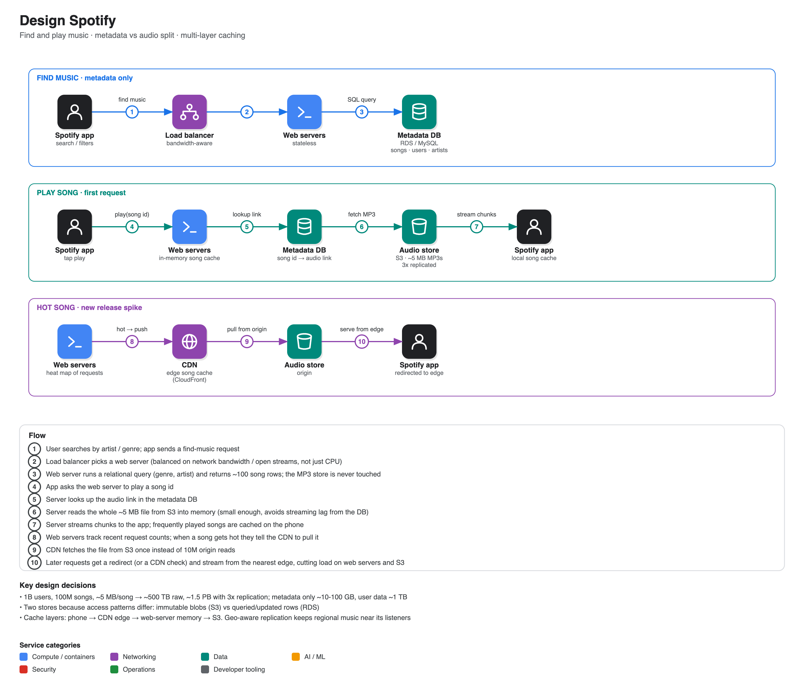

# Design Spotify

**Source:** [Google system design interview: Design Spotify](https://www.youtube.com/watch?v=_K-eupuDVEc) · IGotAnOffer: Engineering · 42 min
**Interviewee:** Mark, ex-Google engineering manager

## Scope

- **In:** finding music and playing music from a phone app.
- **Out:** playlists, podcasts, artists pages, recommendations.
- Scale given: **1B users, 100M songs** (real Spotify ≈ 80M).

## Back-of-envelope

| Item | Estimate |
|---|---|
| Audio per song | ~5 MB (MP3 around 128 kbps) |
| Raw audio | 100M × 5 MB ≈ **500 TB** |
| With 3× replication | **~1.5 PB** |
| Song metadata | ~100 B-1 KB each → **10-100 GB** |
| User metadata | ~1 KB × 1B ≈ **1 TB** |

The coach's note: the missing number was traffic (songs streamed/sec), which drives web-server count and bandwidth. It did not change the high-level design, so skipping it was acceptable.

## Key decision: split storage by access pattern

| Store | Holds | Why |
|---|---|---|
| **S3 (blob store)** | MP3 files | immutable, read-mostly, half a petabyte, scales linearly |
| **RDS / MySQL** | songs, users, artists, playback position | queried (genre/artist), updated, ~TB range |

The coach pointed out the *why* should be said up front, not after being asked.

## Flows

1. **Find:** app → load balancer → web server → SQL query on the metadata DB → list of songs. Audio is never touched.
2. **Play:** app → web server → look up `audio_link` → read the ~5 MB MP3 from S3 into server memory → stream chunks to the app. Reading it fully first avoids stalls mid-stream and avoids a long-lived WebSocket to the database tier.

## Bottleneck: a hot song

A new release from a hugely popular artist means millions of simultaneous requests for the same file, which can overload S3 and saturate web-server bandwidth.

**Multi-layer caching:**

1. **Phone**: frequently played songs stored locally.
2. **CDN (e.g. CloudFront)**: web servers keep a heat map of recent requests; once a song is hot they tell the CDN to pull it. The client then gets a redirect (or checks the CDN first) and streams from the nearest edge.
3. **Web-server memory**: whole-file reads double as a local cache; a shared cache across servers is a further option.
4. **S3**: origin of record.

## Load balancing

CPU-based balancing is the wrong default for streaming. Balance on **network bandwidth, open streams or outstanding requests**, since a server can be network-bound with idle CPU and would then cause skips.

## Global refinement

Replication is for availability *and* locality. Place replicas of regionally popular music (and its metadata) near the users who play it, so playback does not cross an ocean.

## Interview technique called out in the video

- Constrain a giant product to two use cases before drawing anything.
- If you know the product, share what you know; the interviewer will correct you.
- Draw while talking; start simple (app → LB → servers → DB) and split components out later.
- Walk a use case end to end to find bottlenecks (this is how the hot-song problem surfaced).
- Be honest about the limits of your knowledge (load balancing, CDN internals).
- Finish by tying back to requirements and thinking one dimension bigger (geo-aware placement).
