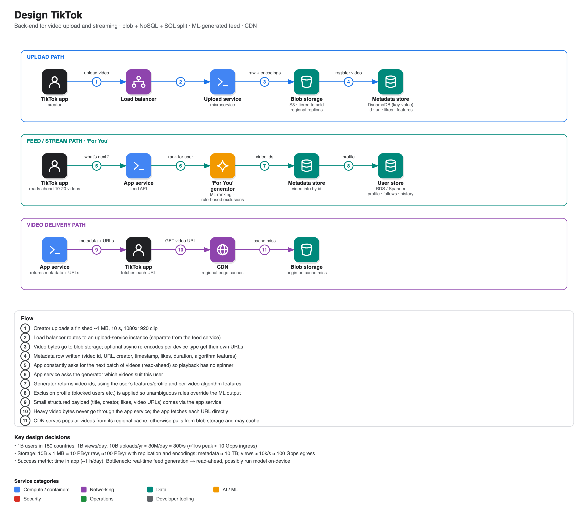

# Design TikTok

**Source:** [Google system design interview: Design TikTok](https://www.youtube.com/watch?v=NHqdG-aZxOk) · IGotAnOffer: Engineering · 1 h 09 min
**Interviewee:** Mark, ex-Google (and Uber) engineering manager

## Scope

- **In:** the distributed back end for **video upload** and **streaming/consumption**, including the personalised "For You" feed at a high level.
- **Out:** the mobile app and creation tools (filters, duets, trimming), sign-up / sign-in.
- **Scale:** 1B users in ~150 countries, 1B video views/day, 10B videos uploaded per year.
- **Success metric:** *time in app* (assumed ~1 hour/day). Mark noted a possible future tweak to avoid maximising it during work/school hours.
- **Assumed video:** vertical 1080×1920, ~10 s average, ~**1 MB**.

## Capacity maths

| Quantity | Calculation | Result |
|---|---|---|
| Uploads | 10B/yr ÷ 365 | ~30M/day ≈ **300/s**, ~1k/s peak |
| Ingress | 1k/s × ~10 Mbit | ≈ **10 Gbps** (a single modern NIC) |
| Raw storage | 10B × 1 MB | **10 PB/yr** |
| With replication + per-device encodings (×10) | | **~100 PB/yr** |
| Metadata | 10B × ~1 KB | **~10 TB** |
| Views | 1B/day ÷ 100k s | **~10k/s**, ≈ **100 Gbps** egress |
| User profiles | 1B × ~10 KB | ~10 TB |

Conclusion: storage volume, not request rate, drives the choices; blobs point at object storage. The coach's note: finish the storage maths (user data) before switching to traffic.

## Storage choices

| Data | Store | Reason |
|---|---|---|
| Video files | **S3-style blob storage** | objects of ~1 MB, huge volume; replicate regionally; **tier old videos to cold storage** (video lifespan is mostly weeks/months) |
| Video metadata (id, URL, creator, created_at, likes, duration, algorithm features) | **NoSQL key-value (DynamoDB)** | ~10 TB, no relational joins between videos |
| User data (profile, following ids, watch history, uploaded video ids, time-in-app, ML profile) | **SQL (RDS / Cloud Spanner)** | social graph links users across regions, so avoid hard-partitioning into separate DBs. ~1 TB fits, but flagged as a future bottleneck |

Mark's stated bias: pick hosted services first because engineer time is the expensive resource, and revisit self-hosting once the scale makes it worth it.

## Services

- **Upload service** and **app (content) service** are separate microservices behind a load balancer.
- **Upload flow:** app → upload service → blob storage (+ optional async re-encodes per device, each with its own URL) → write the metadata row.
- **Streaming flow:** app → app service → **"For You" generator** → list of video ids → app service looks up metadata/URLs → returns the small structured payload → the app fetches each video **directly from the CDN**, which falls back to blob storage on a miss.

## The "For You" generator

- Too many variables for hand-written rules, so ML ranking (neural-network style); trained offline on features extracted from every video, then matched to a per-user profile at request time.
- Per-user features: following graph, content/language preferences, history. Per-video features: length, content, location, language.
- **Exclusion profile / guardrails**: ML updates are asynchronous and slow, but "don't show me this user" must take effect immediately. Apply simple deterministic filtering in the app service or generator on top of the ML output.

## Bottlenecks and enhancements

- **User table size** in one database: partition the largest regions if needed.
- **Real-time generator latency**: the app **reads ahead** (requests the next 10-20 videos in the background) so scrolling never waits. Longer term, move part of the model onto the phone (it has GPU headroom), offloading cloud compute. The coach singled this out as a strong idea.
- **Regions**: place data near users; CDN caches naturally become region-specific. Whether to explicitly partition by region/language was left open.
- **Cost**: once the architecture stabilises, replace expensive managed pieces (DynamoDB / RDS) with self-hosted ones if engineering time is now cheaper.
- A "surprise" injection (occasional out-of-interest video, still passing the exclusion filter) was offered as a product enhancement. The coach noted that for an IC role a *system* enhancement would be preferable.

## Interview technique called out in the video

- Narrow scope by asking, and confirm each cut with the interviewer.
- Know your drawing tool; arrows are optional if you narrate the flow.
- If the design touches something outside your expertise (ML here), include it simplified and say so openly instead of skipping it.
- Match depth to the level: engineering-manager answers can weigh cost trade-offs, IC answers need more technical depth.
