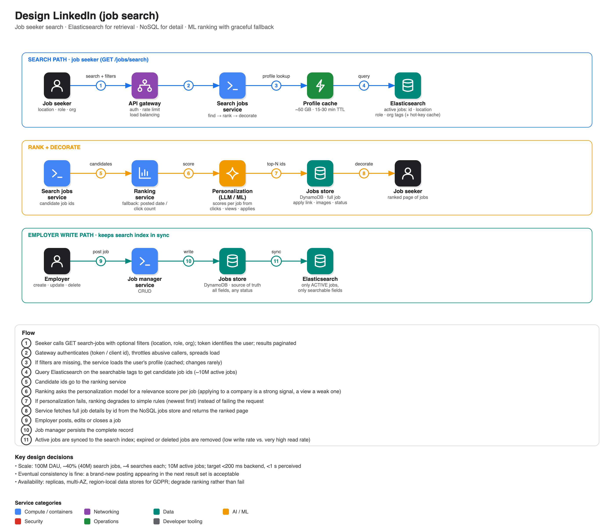

# Design LinkedIn (job search)

**Source:** ["Design LinkedIn" - System design mock with Senior SWE at Amazon](https://www.youtube.com/watch?v=ICu8g9auh8E) · IGotAnOffer: Engineering · 53 min
**Interviewee:** a senior software engineer at Amazon (7 years, ~2,000 interviews conducted). **Interviewer:** Mark, ex-Google EM.

## Scope

- **In:** a *job seeker* finds relevant jobs; results are personalised with AI. Back-end API only.
- **Out:** employer-side features beyond posting jobs, feed/posts/comments, chat messaging, front end.
- **Non-functional:** backend latency **< 200 ms** (so perceived < 1 s), high availability and fault tolerance, **eventual consistency** acceptable (a new job may show up in the next results page).

## Scale

- 100M daily active users, ~40% (40M) come to search for jobs, ~4 searches each → ~160M searches/day, i.e. a few thousand QPS on average and on the order of 10-20k QPS at peak (the candidate's arithmetic wandered between 2k and 20k; the point was "peak = several × average").
- ~10M active jobs.

## API

`GET /jobs/search` with optional filters (location, role, organisation). The user's profile is already available server-side, so filters can be omitted. Response: list of jobs (id, organisation, role, experience, skills) with a status code. Includes:

- **pagination** (popular roles return many hits),
- validation and exception handling,
- **authentication** by token or client id, which also enables **throttling** against abuse/denial of service.

## Architecture

| Component | Role |
|---|---|
| **API gateway** | auth, rate limiting, load balancing |
| **Search jobs service** | orchestrates: find → rank → decorate |
| **Jobs data store (DynamoDB)** | source of truth for every job (any status, all fields incl. apply link, images). Written by the employer-facing **job manager service**. Unstructured and large, so managed NoSQL |
| **Elasticsearch** | holds only **active** jobs and only **searchable tags** (job id, location, role, organisation). Synced from the jobs store; expired/deleted jobs removed. Read-heavy, so it is the scaling hot spot |
| **User profile DB** | profile and history; changes rarely |
| **Ranking service** | orders candidate ids |
| **Personalization service** | LLM/ML model producing a relevance score per job from clicks, views, applies, profile |

The interviewer asked the key clarifying question: *why two job stores?* Answer: the NoSQL store is the complete record; the search index is a small projection optimised for multi-field queries. Search first retrieves ids from Elasticsearch and then decorates them from the NoSQL store.

### Ranking

Start simple (posted date, click count, same for every user), then add personalization. Behavioural signals are weighted: *applied to this company* is stronger than *viewed*. **Fallback:** if the personalization service is down, rank by simple rules instead of failing the request.

## Performance and availability

- **Cache the user profile** (changes rarely): only the textual fields that matter (~1 KB each); ~50M users in a 15-30 minute window ≈ **50 GB**.
- **Cache hot search keywords** (e.g. "AI") in front of Elasticsearch, still personalised afterwards. For active jobs the estimate was ~10 GB per... (stated loosely) ≈ **100 GB**.
- Replicas for every store, multi-AZ.
- **Regional data stores**: different scales per geography, and compliance (e.g. GDPR data residency) keeps impact local.

## Extensions explored

- **LLM-first architecture:** gateway → search service → an in-house AI engine that already knows jobs and user activity; the same engine behind a chatbot assistant. Trained on LinkedIn's own data (in-house, not the public cloud model), with implicit feedback (clicks, applies) in a feedback loop.
- **"I'm feeling lucky" / auto-apply:** no parameters, just the user id; the AI picks and applies to the top 10 matches.

## Interview technique called out in the video

- State the approach and say you will take notes before diving in.
- Scope out a huge product (LinkedIn) to one persona and one use case, and confirm it.
- Separate back-end latency from user-perceived latency.
- Write down the API even if trivial; mention auth, pagination, throttling.
- Justify each data store with an example of what goes in it, plus its scale (read-heavy vs. write-light).
- For the refinement phase pick the components that benefit most (caches, replication) and be ready for sizing questions with actual numbers.
- If the interviewer pushes beyond the problem, brainstorm at a high level instead of getting lost in details.
