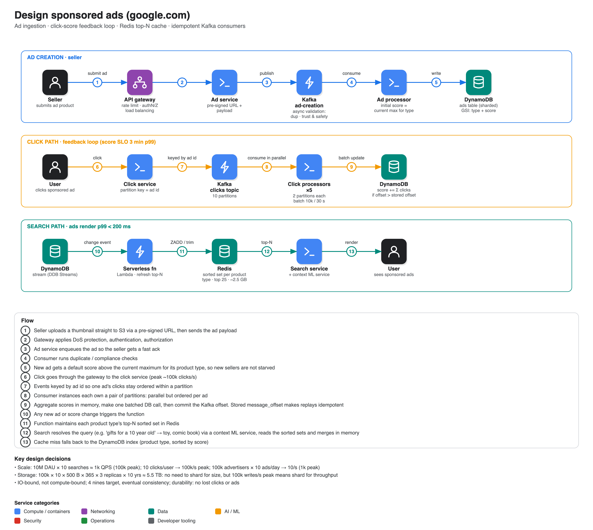

# Design Google sponsored ads

**Source:** [Google / Meta system design interview: "Design Google Ads"](https://www.youtube.com/watch?v=efaBYHvNvbA) · IGotAnOffer: Engineering · 38 min
**Presenter:** a senior engineering manager at Atlassian (ex-staff SWE at Meta, ex-principal EM at Microsoft), walking through a question recently asked at a FAANG company.

## Requirements

**Functional**

- Sellers submit ad products (a sponsored ad can hold several products, from one or many sellers).
- A user searches (e.g. "iPhone") and sees sponsored ads; Google earns a referral fee on a click.
- Ranking is simple: **each click adds 5 points** to the ad's score, creating a feedback loop.
- Scale: **100M sellers, 1B products**.

**Non-functional**

| | Target |
|---|---|
| Availability | 4 nines (stretch: 5) for both ad intake and search |
| Consistency | **eventual**: two users may briefly see different top ads until scores settle |
| Click → score latency | 3 min at p99 |
| Ad render latency | < 200 ms at p99 |
| New-ad processing | 1 min at p99 |
| Durability | no loss of clicks or ad submissions |
| Also | fault tolerant, scalable; cost and security "below the cut line" |

## Back-of-envelope

| | Calculation | Result |
|---|---|---|
| Search | 10M DAU × 10 ÷ 10⁵ s | **1k QPS**, 100× peak = **100k** |
| Ad creation | 100k advertisers × 10 ads ÷ 10⁵ | **10/s**, peak 1k |
| Clicks | 10M × 10 ÷ 10⁵ | ~**1-2k/s**, peak **100k** |
| Storage | 100k × 10 ads × 500 B × 365 × 3 replicas × 10 years | **~5.5 TB** |

The system is **I/O-bound** (network and storage), not compute-bound.

## Architecture

- **API gateway:** rate limiting (DoS/DDoS), authN/Z, load balancing.
- **Ad creation:** the seller gets a **pre-signed S3 URL** and uploads the thumbnail directly, then sends the payload to the ad service → **Kafka** ad-creation topic → ad processor (validation, default score) → **DynamoDB**.
- **Click path:** click service → Kafka clicks topic (key = ad id) → click processors → batched score update in DynamoDB.
- **Ranking cache:** DynamoDB Streams triggers a serverless function that updates **Redis sorted sets**, one per product type, holding the top 25. A sorted set is a hash table plus a skip list, so top-N is cheap. Memcache was rejected as too vanilla.
- **Search:** search service reads the Redis top-N, and on a miss queries a DynamoDB **global secondary index (partition = product type, sort = score)**.

### Data model (`ads` table)

`ad_id` (partition key), `product_id`, `product_type`, `title`, `price`, `image`, `seller_id`, `seller_name`, `score`, `message_offset`, metadata, created/updated. Partitioning by `ad_id` rather than `seller_id` avoids hot partitions from large sellers.

Cache sizing: 100k product types × 25 ads × 1 KB ≈ **2.5 GB**.

## Trade-offs discussed

| Decision | Choice and reasoning |
|---|---|
| SQL vs NoSQL | NoSQL (DynamoDB or equivalent): no hard transactional need, only the click processor updates scores |
| Sharding | Data is only ~5.5 TB (shard at ~50 TB), but peak writes of ~100k/s (sharding is warranted above ~10-20k writes/s) |
| Ad creation sync vs async | Only ~1k/s, so synchronous is defensible; async chosen so validation (duplicates, trust & safety) does not hold the connection and the seller gets a fast ack |
| Clicks sync vs async | Async: decouples the 100k/s write load from the user-facing path |
| Batching clicks | Use the 3-minute SLO: flush every N seconds or 10k clicks, aggregate (5,000 clicks → +25,000) and make one batched DB write |
| Redis vs Memcache | Redis for sorted sets |

## Deep dives

1. **Vague queries ("gifts for a 10 year old"):** tagging ads with every phrase duplicates data and cannot predict queries; instead a **context ML service** maps the query to product types (toy, comic book, stationery); search reads each type's top-N and merges in memory.
2. **No results (e.g. "pencil"):** return nothing.
3. **Cold start / starvation:** give new ads a default score **above the current maximum** for their product type so new sellers get exposure.
4. **Millions of clicks per minute:** Kafka with N partitions, a pool of consumer instances each owning a fixed set of partitions (e.g. 2:1 mapping, 10 partitions → 5 processors), with a primary and secondaries and ZooKeeper-style failover. Key by ad id so per-ad ordering holds.
5. **Correctness of scores (exactly-once effect):** a crash after the DB write but before the Kafka offset commit would replay the batch and double-count. Store the last applied `message_offset` on each ad; skip any click event whose offset is ≤ the stored one.
6. Left as an exercise: heavy write load on a single hot product type (e.g. a new iPhone launch).

## Breadth topics

- **Metrics:** CPU, heap, threads, pending Kafka messages, end-to-end latency, cache hit %, plus business metrics (clicks per ad, search latency, seller-facing latency, incidents).
- **Testing:** > 90% line and branch coverage, integration, performance, scale, alpha/beta.
- **Rollout:** dial up 1% → 5 → 10 → 25 → 50 → 70 → 100% with soak periods.

## Staff-level calibration noted in the video

- Lead the interview yet stay collaborative: two or three explicit check-ins.
- A mature, extensible solution, with 2-3 genuine deep dives, and something the interviewer learns.
- Time management, product mindset, ambiguity resolution, back-of-envelope maths that actually drives the design, at least 4-5 trade-offs, and breadth (monitoring, deployment, security, cost).
