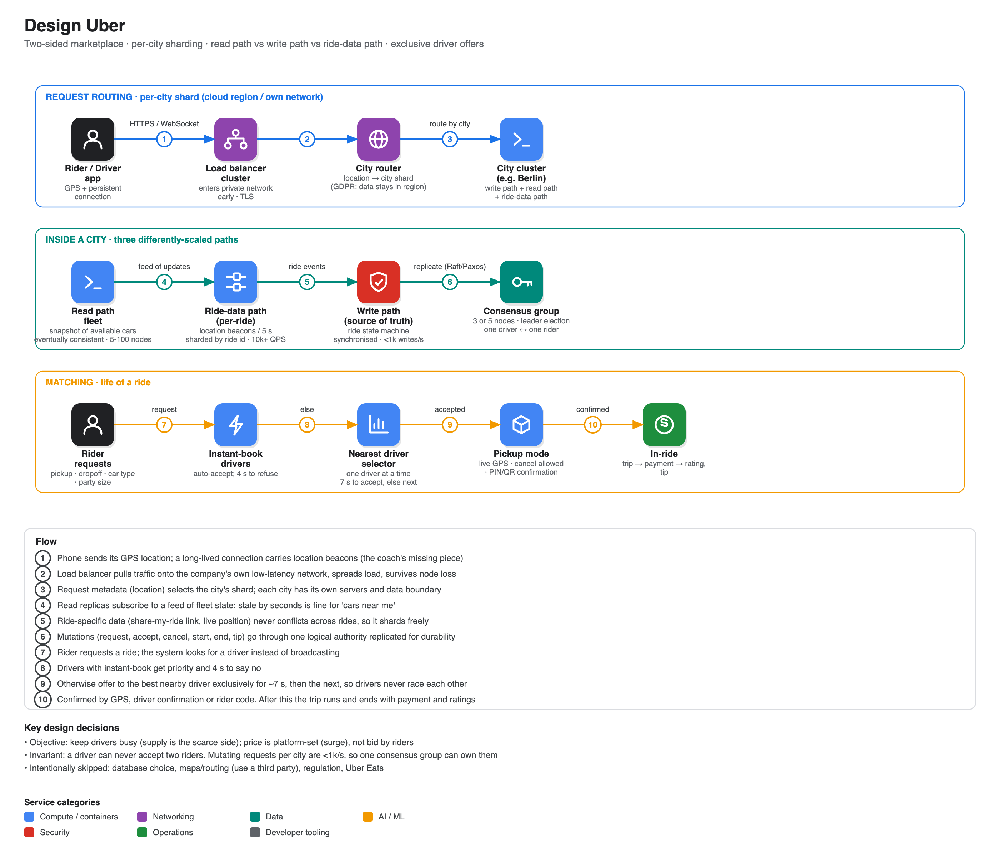

# Design Uber

**Source:** [Uber system design: mock interview walk-through with Dima Korolev (ex-Google)](https://www.youtube.com/watch?v=wL-Gx5XE9XE) · IGotAnOffer: Engineering · 48 min
**Interviewee:** Dima Korolev (hired by Google after topping TopCoder's algorithm track; hosts the System Design Meetup channel). He steps out of character for tips. Interviewer: Tom.

## Requirements discussed

Uber is a **two-sided marketplace** (riders and drivers). The interesting problem is *connecting* them.

**Rider:** book a ride from GPS location or a chosen point, now or later; change or cancel; pickup/drop-off points (airports are a whole problem of their own); ratings.
**Driver:** mark themselves available with a car type and capacity (X, Black, Large, pets, kids); receive requests; accept; "going home" mode that biases requests toward their direction without telling them a rider's destination (so riders to unpopular areas are not refused).
**Platform:** price-setting engine with **surge pricing**. Uber sets the price itself; riders do not bid.

**What it optimises:** keep drivers busy. Supply is the scarce side, so driver engagement and the matching algorithm matter most, alongside ratings.

## Matching logic (the "life of a ride")

1. Rider requests a ride.
2. **Do not broadcast** to all nearby drivers; it would create a race and distract drivers.
3. **Instant-book / auto-accept drivers** (like Airbnb instant book) go first and get ~**4 s** to refuse.
4. Otherwise pick the best nearby driver (idle or about to finish) and offer exclusively for ~**7 s**. If no answer, move on to the next.
5. **Pickup mode:** real-time GPS for both phones; either side can cancel. Navigation is a third-party map (or Uber's own); curbside tweaks are a product refinement.
6. **Confirmation** by GPS, manual driver confirmation, or a 4-digit code / QR the rider shows (important where trust is low).
7. In ride → end → payment, rating, tip.

## Architecture

- **Where to deploy** (cloud provider vs own hardware) is stated up front; the design should be agnostic.
- **Load-balancer cluster** (several nodes so one failure does not matter) brings the user's request into the company's own network as early as possible, which is faster and more reliable than the public internet. The public endpoint is something like `api.uber.com` over HTTPS.
- **Per-city sharding:** the request carries GPS coordinates, so the balancer can route it to the right city's servers. This also supports data-residency rules (e.g. German data stays in Germany).
- **Inside a city, three paths with very different needs:**

| Path | What it does | Consistency and scale |
|---|---|---|
| **Read path** | "How many cars are near me?" | Eventually consistent: 5-30 s stale is fine. Scale with many interchangeable nodes subscribed to a feed (≈ CDN-like): ~5-10 nodes for a mid-size city, ~15 for New York |
| **Write path** | ride state machine: requested → accepted → started → ended/cancelled | **Strongly consistent single source of truth.** Invariant: a driver cannot accept two riders. Well under 1,000 mutating requests/s per city, so it fits one logical authority |
| **Ride-data path** | live location beacons (~every 5 s per driver and rider), the "share my ride" link | 10,000s of QPS but rides never conflict, so **shard by ride id**; losing a node costs ~30 s of position updates, acceptable |

- **Durability of the write path:** run an **odd number (3 or 5) of replicas with leader election** (Raft/Paxos-style consensus). If the leader dies, a new one is elected within moments. A startup could begin with a single machine plus a backup.

## Coach feedback noted in the video

- Clarify scope first (rides only? Uber Eats? existing Uber or an improved one?) and state assumptions. Dima did not, and went deep on requirements; that suits Uber (very product-first) but at e.g. Google you would move faster to the design.
- At senior level discuss protocols: he mentioned HTTPS but not **WebSockets** (persistent connections for continuous location updates; one API call per update would be wasteful).
- More senior = more product-first; research what the target company values.

## Metrics (answer to "how do you know it works?")

- System: traffic into each city and between internal components; any unexpected drop is an alarm.
- Product: live rides in progress (a daily sine wave; deviations alert), ride length, driver and rider ratings, **average pickup time and rider-to-driver distance**. New matching algorithms are A/B tested on subsets of drivers.

## Takeaways

- The "obvious" high-level diagram is not what Uber actually runs; the value is in reasoning about consistency, data flows and scale per path.
- He deliberately left **database choice** out ("the high-level picture trumps SQL vs NoSQL") and advised candidates *not* to skip it.
- Product-first bonus points: suggest better pickup spots, curbside pickup, and similar.
