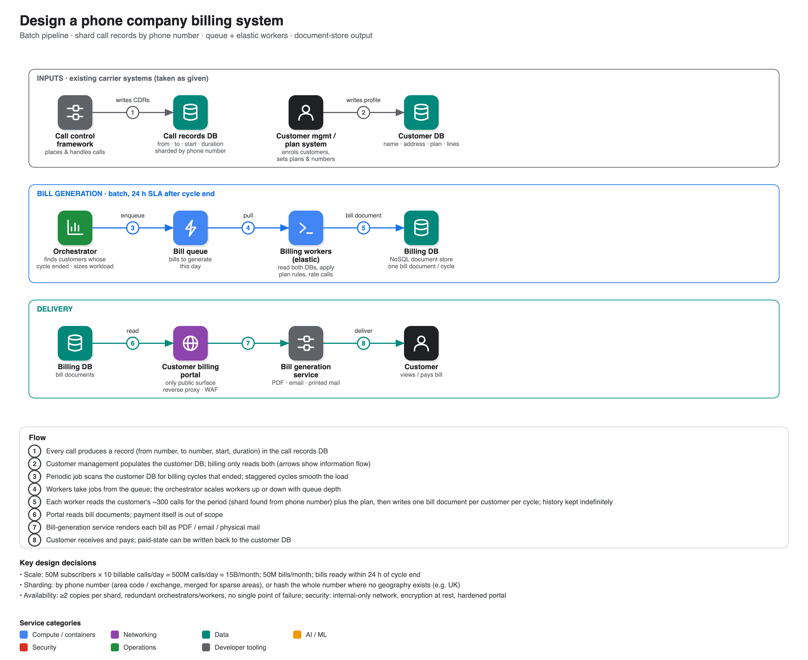

# Design a phone company billing system

**Source:** [Amazon system design mock interview (with Senior SWE)](https://www.youtube.com/watch?v=i_RCwKflp3I) · IGotAnOffer: Engineering · 50 min
**Interviewee:** Tim, ~30 years of software engineering, two years at AWS on its routing platform, now embedded router development. The question was "How would you design a phone company billing system?"

## Scope

- **In:** work out which calls a customer made in a billing period and **generate the basis for a bill**; show where bill generation plugs in.
- **Out:** value-added services (caller ID, voicemail), data usage, the payment transaction itself, the call control framework and customer management.
- A national carrier with **50M subscribers**, a "budget plan" so assume **10 billable calls/day per customer** (deliberately high). Plans differ per customer.
- Bills must be available **within 24 hours** of a customer's cycle ending. Cycles are **staggered** by start date (a plan started on the 13th ends on the 12th), which spreads the load but unevenly.

## Numbers

| | |
|---|---|
| Calls/day | 50M × 10 = **500M** |
| Calls/month | ≈ **15B** (the transcript's spoken figures were inconsistent; 500M × 30 gives 15B) |
| Bills/month | **50M** |
| Calls per bill | ~**300** records to find among billions |

Non-functional: scalability, availability, performance, security. Not real-time (24 h window), which is "pretty forgiving".

## Architecture

1. **Inputs taken as given:** a **call records database** (from number, to number, start time, duration, …) written by the call control framework, and a **customer database** (name, address, plan, lines/numbers). The billing service mostly only reads them. Arrows show information flow rather than who initiates.
2. **Billing service** runs periodically (conceptually a cron job): find customers whose cycle has ended, read their calls from the call DB, combine with plan/business rules, and write a **bill** to a billing database.
3. **Billing database** holds both the upcoming bill and indefinite history: calls made, per-call charges, base plan cost, services.
4. Two consumers: a **customer billing portal** (view/pay) and a **bill generation service** (email, PDF, printed mail).

## Decisions

- **Billing DB = NoSQL document store.** Each bill is a self-contained blob per customer per month, easy to scale and to render straight into a PDF.
- **Sharding the call records** (the biggest data set): by **phone number**. Area code gives geographic locality; subdivide big area codes by exchange (next three digits) and merge sparse ones into one shard. Where numbers have no geography (e.g. UK mobiles) **hash the whole number**. Questions from the interviewer: uneven shard sizes and area codes not existing in Europe.
- **Scaling the billing service:** an **orchestrator** estimates the day's workload (number of bills due), fills a **queue** of bills to generate, and **elastic workers** drain it; scale workers with queue depth. Sizing is found empirically. Whether 24 h is a hard or soft target decides how aggressive scaling must be. One billing service instance per shard group (e.g. per area code) keeps reads local.

## Follow-up questions

- **Availability:** at least two copies of every shard including the billing DB; multiple orchestrators and workers that are replaceable, so no single point of failure; monitoring of the orchestrator.
- **Security:** the whole system except the portal is internal behind firewalls (PII-heavy); encrypt long-term storage; harden the portal with a reverse proxy and firewalling so it cannot be a pivot into the backend.

## Coach feedback noted in the video

- Ask clarifying questions to set functional and non-functional requirements; ballpark calls/sec but do not get stuck on numbers.
- Check in with the interviewer at the end of the high-level design.
- Practise the whiteboard tool beforehand.
- Drill into the component you know best; look for bottlenecks and address them proactively.
- Do a self-check against the original requirements.
- Stay on firm ground, and admit gaps honestly (Tim did not name a specific queue/service-bus product). For a security-focused role, expect to go deeper on security.
- At large companies the role or team may be unclear, so ask the recruiter what to prepare.
