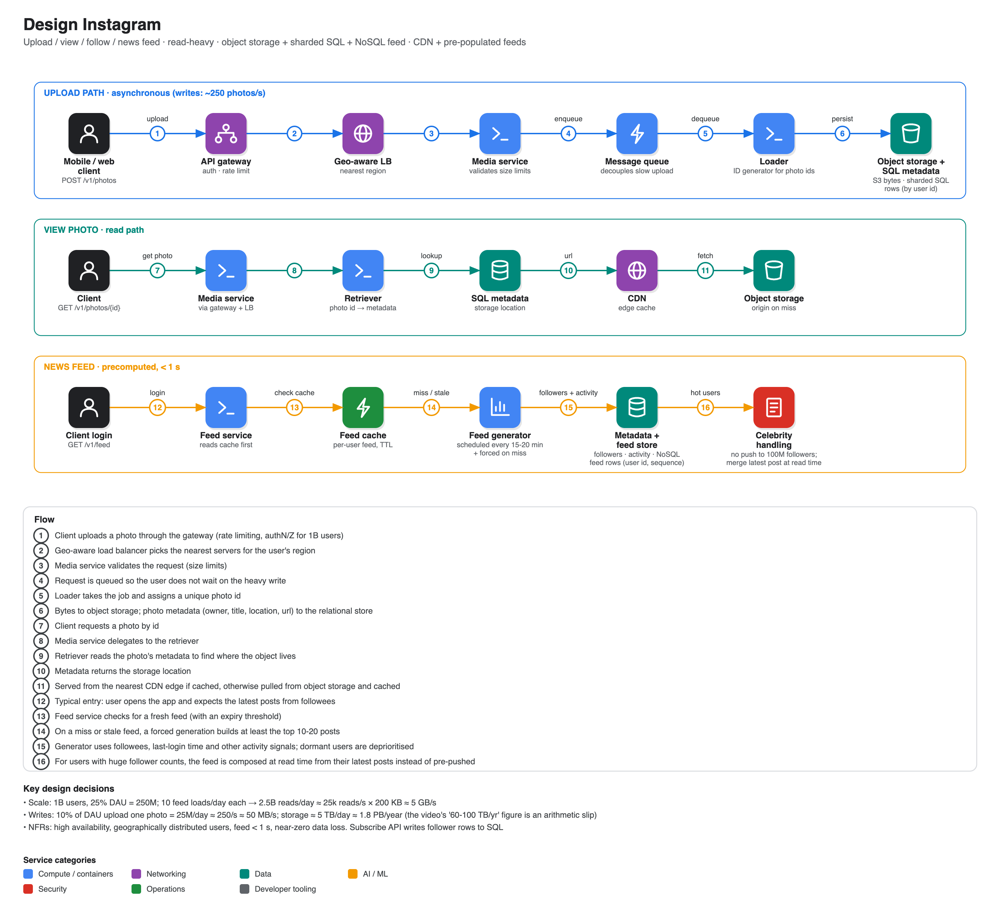

# Design Instagram

**Source:** [Meta system design interview: Design Instagram (with ex-Meta data engineer)](https://www.youtube.com/watch?v=DXpJCh5_KT4) · IGotAnOffer: Engineering · 1 h 02 min
**Interviewee:** Kartik, ~15 years in data engineering (senior manager at a financial institution, formerly a data engineer at Meta). (The auto-generated captions for this video are a machine translation, so some phrasing below is interpreted.)

## Requirements

**Functional:** upload photos, download/view photos, search photos by title, follow another user ("follower" follows a "followee"), and a news feed on login. Likes, tags and comments are out of scope.
**Non-functional:** high availability, geographically distributed users, news feed latency **< 1 second**, high reliability (almost no data loss).
The agenda he set: 15-20 minutes of requirements, then data model, then detailed design.

## API (versioned, split into reads `GET` and writes `POST`)

- `GET /v1/photos/{id}` · `GET /v1/search?title=…` · `GET /v1/feed`
- `POST /v1/photos` · `POST /v1/subscriptions`

Initial design thoughts derived from the requirements: replication and redundancy for availability; distributed servers + **CDN** for geo-distributed users; **pre-populated / cached feeds** for the 1 s target; **object storage** for durable large objects.

## Estimates

| Item | Calculation | Result |
|---|---|---|
| Users | 1B total, 25% daily active | **250M DAU** |
| Feed reads | 250M × 10 opens ÷ 10⁵ s | **25,000 reads/s** (very read-heavy) |
| Read bandwidth | 25,000 × 200 KB | **≈ 5 GB/s** |
| Uploads | 10% of DAU upload one photo = 25M/day | **≈ 250 photos/s** |
| Upload bandwidth | 250 × 200 KB | **≈ 50 MB/s** |
| Storage | 25M × 200 KB | **≈ 5 TB/day ≈ 1.8 PB/year** |

> **Correction:** in the video the interviewee concluded "about 60 TB per year" and later "~100 TB per year" from 5 TB/day. 5 TB × 365 ≈ 1,800 TB, so the right figure is petabyte-range, which actually strengthens the case for object storage, tiering and CDN.

## Data model

| Entity | Notes |
|---|---|
| `user` | id (int/long), name, email, date of birth, address, created_at |
| `photo` | id, owner `user_id` (FK), storage location (URL/key), title (searchable), description, latitude/longitude, created_at. The bytes live in object storage; only metadata in SQL |
| `user_subscription` | subscriber id, subscribed-to id (optionally its own id) |
| `news_feed` | partition key `user_id`, entry id, created_at, array of feed records (sequence number, photo id and any data needed to render fast) |
| `user_activity` | last login, follower count, and other signals used to decide whose feeds to build |

## Architecture

- **API gateway:** single entry point, rate limiting, authentication, authorization (1B users, unknown attackers).
- **Geo-aware load balancer** sending requests to the nearest servers.
- **Media service** handles upload and download. Uploads go through a **message queue** to a **loader** so the user is not blocked; it writes bytes to **object storage** and metadata to the **relational store**. A **unique ID generator** supplies photo ids. A **retriever** resolves id → metadata → object for downloads. A **cloud CDN** fronts object storage, with fallback to origin.
- **Storage choices:** object storage (scalable, reliable, effectively unlimited objects); **relational** for metadata, **sharded by user id** so a user's data sits on one server; **NoSQL** for feeds for microsecond-range reads.
- **Subscription service** updates follower relationships in the relational store.
- **Search** uses a separate indexing service on photo titles (mentioned at the end for lack of time).

## The news feed (the hard part)

- Building a feed at login by fetching all followees' top photos would never fit in 1 s, so **pre-generate** it.
- **Feed service** → **feed cache**; if the cached feed is missing or too old (expiry threshold) it triggers a **feed generator**; a scheduled job refreshes feeds every ~15-20 minutes.
- Fallback when completely stale: forced generation of at least the top 10-20 posts, which is expensive but bounded.
- The generator reads followees from the metadata DB, picks the top posts, pulls the photos from object storage.
- **Prioritise with activity data:** do not pre-build feeds for users who have not logged in for days.
- **Celebrity problem:** a user with 100M followers should not trigger 100M feed updates, since perhaps 10% log in within the hour. Flag them as "advanced" users, push only to the most active followers, and for everyone else **merge their latest post at read time** from a dedicated cache. Users can become popular suddenly, so the flag must be recomputed.

## Scaling Q&A in the video

Asked how storage scales for a read-heavy system: object storage is scalable by design; shard SQL metadata by user id; NoSQL is distributed by design; replication and redundancy for reliability; CDN + caching for read traffic. He kept technology names generic on purpose (DynamoDB, Cosmos DB, S3 are interchangeable at this level).

## Wrap-up and trade-offs

Left for more time: feed ranking algorithms (activity signals and more), the sharding method in detail (hash by user id), search indexing, and use-case details. The coach noted you cannot fully design Instagram in 45 minutes, so mention trade-offs and open issues at the end.

## Coach feedback noted in the video

- Fix the boundaries of the task first; functional requirements become APIs and non-functional ones drive scaling/sharing decisions.
- Jot "initial design thoughts" beside the requirements and check them with the interviewer.
- Estimate DAU, QPS, bandwidth and storage, and note whether the system is read- or write-heavy.
- Introduce helper tables (like `user_activity`) when a feature needs them.
- Build one API flow at a time, start to finish.
