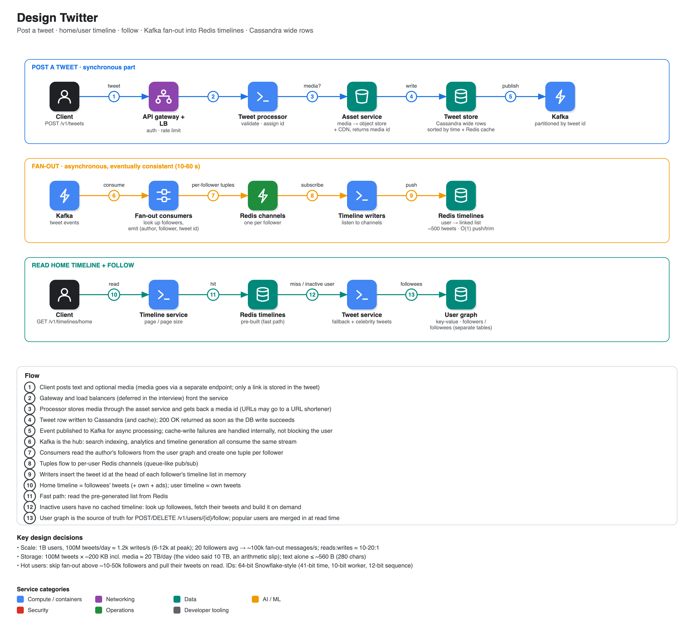

# Design Twitter

**Source:** [Twitter system design mock interview (with Senior Software Engineer)](https://www.youtube.com/watch?v=3yW856jAbZA) · IGotAnOffer: Engineering · 55 min
**Interviewee:** Eugene (senior engineer and manager since 2010; runs the Crushing Tech Education channel). Interviewer: Tom.

## Scope

- **In:** post a tweet (text, links, photos, video), **home timeline** (followees' tweets + own + ads) and **user timeline** (own tweets), follow / unfollow. Search only if time allows.
- **Assumptions:** read-heavy (about 1:10-1:20 writes to reads); **eventual consistency of 30-60 s** is fine; recent data dominates, but old tweets must stay searchable.

## Estimates

| | |
|---|---|
| Users | 1B active, ~200M daily, ~100M tweet per day, ~200 followers on average (20 used for fan-out maths) |
| Tweet size | ≤ 280 chars (text is small); ~200 KB average including media |
| Writes | 100M ÷ 86,400 ≈ **1.2k/s**, peak ×5-10 = **6-12k/s** |
| Fan-out | ~12k/s × 20 followers ≈ **~100k timeline inserts/s** |
| Storage | 100M × 200 KB = **20 TB/day** (the video states 10 TB/day, which is a slip) |

## API

- `POST /v1/tweets {user_id, content, media}` (media uploaded through a **separate endpoint**, only links stored in the tweet)
- `POST /v1/users/{id}/follow` and `DELETE /v1/users/{id}/follow`
- `GET /v1/timelines/home?page&page_size` and `GET /v1/timelines/user/{id}?page&page_size`; the caller id comes from the header

## Data model

- `tweet(tweet_id, user_id, created_at, content)`; media links live inside content.
- `user_relation(follower_id, followee_id)`: many-to-many, 2 rows per follow in the naive version. Improvement: split into **followers** and **followees** tables, scaled separately (at the cost of two writes that can briefly disagree).
- `user` table (standard).

## Components

| Component | Role |
|---|---|
| **Tweet processor** | Receives tweets, calls the **asset service** for media (object store + CDN, returns a media UID) and optionally a **URL shortener**, writes to the DB, returns success, then publishes to Kafka |
| **Cassandra** | Tweet store: wide rows sorted by time, so the latest N tweets of a user can be read without touching old data. **Redis** cache beside it (write-through; cache failures never block the user) |
| **Kafka** | Hub for all downstream consumers: timeline generation, search indexing, analytics. Partitioned by **tweet id** (not user id) so celebrities do not create hot partitions |
| **Fan-out consumers** | For each tweet, read the author's followers from the **user graph service** (key-value DB) and emit a tuple `(author, follower, tweet id)` per follower |
| **Redis channels** | One per user (queue-like); timeline writers listen and push the id into that user's timeline |
| **Redis timelines** | `user → doubly linked list` of ~500 recent tweets. Insert and delete at the ends are O(1), and it all stays in memory, so reads are instant |
| **Timeline service** | Reads Redis; on a miss (inactive user) asks the user graph for followees, pulls their tweets through the **tweet service** and builds the timeline on demand |

The whole hot path is kept in RAM: Kafka → Redis channels → Redis timelines.

## Deep dive: partitioning tweets

| Option | Result |
|---|---|
| By **user id** | A user's tweets on one server and easy reads, but hot users overload a server |
| By **tweet id** | Even distribution (the main entity is the tweet), but a user timeline must query every partition |
| **Double hashing** (user then tweet id) | Spreads load while keeping some locality, but moving partitions is complex, so "questionable" |

He settled on tweet id, possibly with double hashing.

## Improvements

- **Popular users:** this pipeline is for normal accounts (< ~10k-50k followers). For a user with 80M followers creating 80M tuples would stall the system, so mark popular users and **pull their tweets at read time** and merge into the timeline.
- **Globally unique, time-sortable IDs:** 64-bit Snowflake-style: 1 sign bit + 41-bit timestamp + 10-bit worker id + 12-bit sequence (4,096 IDs per worker per time unit). Time-ordered ids let Cassandra serve "last 20/100/500" without scanning history.
- Split the follower/followee tables as above.
- Search and analytics are extra consumers on the same Kafka stream.

## Coach feedback noted in the video

- Reduce the question to the main workflows, confirm functional and non-functional assumptions, then check adjacent features.
- Estimate capacity, then API, then main entities, then the architecture.
- Pub/sub (Kafka) to decouple publishing from processing was called out as a good decision.
- Walk the diagram a second time out loud; it catches things you missed.
- Finish with corner cases: uneven traffic from popular users, and the DB as the usual bottleneck, with several approaches and their trade-offs.
