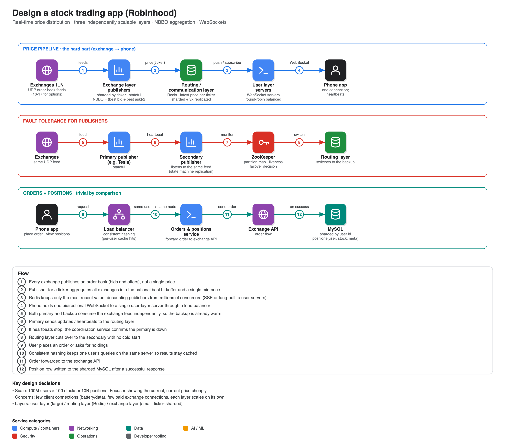

# Design Robinhood (stock trading app)

**Source:** [System design interview: Design Robinhood (with ex-Google SWE)](https://www.youtube.com/watch?v=Zvr-ffhvw0Y) · IGotAnOffer: Engineering · 43 min
**Interviewee:** Jordan (runs the "Jordan has no life" system-design channel; ex-Google, now at a high-frequency trading firm). Interviewer: Tom.

## Scope and focus

Requirements: send orders, keep track of each customer's positions, and (the part he chose to focus on) **show the correct, current price of a stock or option**. Orders and holdings are deemed "trivial": exchanges have APIs, so it is mostly forwarding plus a couple of databases, sharded if needed.

Capacity given: **100M users × ~100 stocks = 10B positions**.

Design concerns:

1. Keep per-device load minimal. Many connections to many servers would drain battery and data.
2. Keep **exchange connectivity small**, because it costs money.
3. Do not collect or ship more data than necessary.

## Why prices are hard

Exchanges do not publish "Apple = $80". They publish an **order book**: several bids (79, 78.5, 78…) and offers (81, 81.3, 81.6…), and options trade on **16-17 exchanges** at once. Robinhood shows one price, so you must aggregate:

- **NBBO (national best bid and offer)** = highest bid across all exchanges and lowest offer.
- Displayed price = **(best bid + best offer) / 2** (a weighted average is possible but not used).

## Three layers (scale independently)

| Layer | Size | Job |
|---|---|---|
| **Exchange layer** (publishers) | kept as small as possible (paid feeds) | Sharded **by ticker symbol**, so all data for a ticker from every exchange reaches one node. Listens to UDP feeds and computes the NBBO |
| **Routing / communication layer** | independent | **Redis** cache sharded by ticker, holding only the *latest* price per ticker (old values are worthless). Chosen over Kafka even though Kafka's log would help diagnostics. Replicated 3×; a coordination service tracks which shard holds which tickers |
| **User layer** | as large as the device count | Servers that talk to phones. **WebSocket** per device (bidirectional, auto-reconnect, no repeated headers; chosen over server-sent events and long polling). Behind a **round-robin load balancer**, optionally weighted by tickers already being served |

Placing a routing layer between publishers and user servers stops a stock held by 10M users from creating 10M subscriptions on the Apple publisher.

### NBBO algorithm inside a publisher

Keep a **doubly linked list plus hash map** of each exchange's current best bid: when an exchange sends a new best bid, remove its old node in O(1) via the map, then insert the new one in sorted position so the head is always the national best. Same for offers (lowest first). Compute the mid price. (The video states the sorted insert as O(log n) via binary search, but binary search on a linked list is O(n); a heap or balanced tree gives the stated bound.)

## Fault tolerance

- **Phone ↔ user server:** WebSocket **heartbeats**; if they stop the phone reconnects through the load balancer. Round robin avoids a thundering herd on one survivor; ZooKeeper can confirm a server is truly down rather than the phone being offline.
- **Routing layer:** plain replication.
- **Publishers are stateful**, so a cold backup would have to warm up from the exchanges. Use **state machine replication**: the backup also listens to the exchange feeds directly and holds the same state. If heartbeats from the primary stop, the coordination service confirms and the routing layer switches to the backup.

## Orders and positions

A service behind a load balancer using **consistent hashing** (a user's positions are cached on the same node), forwarding orders to the exchange API and, after a successful response, writing to **MySQL sharded by user id**. A `positions` table stores user id, stock id and metadata such as purchase price. Interaction rates are low, so the database is not the bottleneck.

## Coach feedback noted in the video

- Jordan "gave a textbook performance" in communication: talks through his thinking, checks in often.
- Ask the interviewer the right questions about domains you do not know (exchanges); capacity numbers can come from the interviewer, though estimating them yourself is better.
- He did not start drawing until about 30 minutes in (normally you want to draw after ~20), but the discussion gave a solid foundation. Another interviewer might have wanted earlier visuals.
- Splitting the system into three layers that scale independently while limiting client load was a smart decision.
- Fault tolerance could have been probed more.
