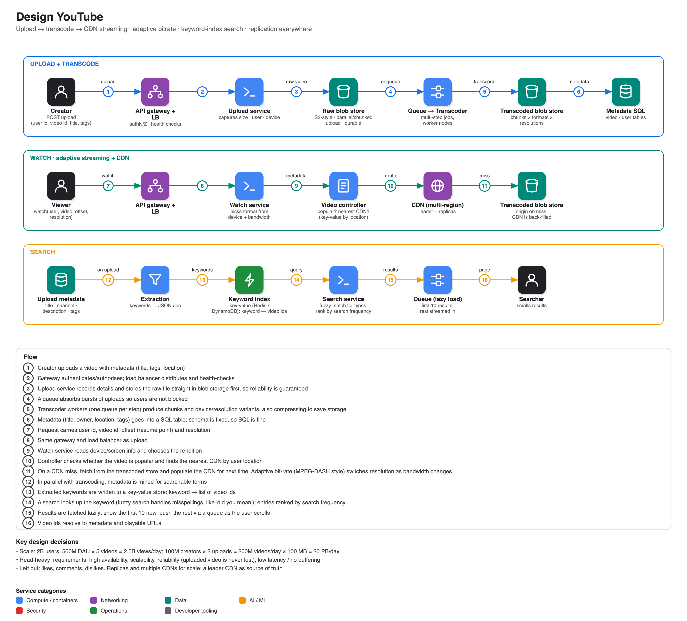

# Design YouTube

**Source:** [FAANG system design interview: Design YouTube (with FAANG Senior SWE)](https://www.youtube.com/watch?v=hqa2sfoGRlI) · IGotAnOffer: Engineering · 46 min
**Interviewee:** Ravi, senior software engineer at a FAANG company, ~11 years in distributed systems and backends. Interviewer: Tom.

## Scope

- **In:** upload video, watch video, search video.
- **Out:** likes, dislikes, comments.
- **Non-functional:** high availability, scalability (demand spikes on viral videos), **reliability** (an uploaded video must stay intact), **low latency / no buffering**. He kept referring back to these.

## Estimates

| | |
|---|---|
| Users | 2B total, **500M daily active** |
| Views | 500M × 5 videos/day = **2.5B views/day**, a read-heavy system |
| Uploads | 100M creators × 2 videos = **200M uploads/day** |
| Storage | 200M × ~100 MB = **~20 PB/day** (20,000 TB). Hence blob storage and compression |

The coach's remark: tie the numbers to the design choices explicitly (e.g. blob storage *because* of media volume), and aim to spend about 5 minutes on clarification.

## API

- **Upload:** `user_id`, `video_id`, `title`, plus optional tags/location; returns 200 on success or an error.
- **Watch:** `user_id`, `video_id`, `offset` (resume point for chunked playback), `resolution`; returns the **video chunks**.
- (The coach noted the API could have been discussed straight after the estimates.)

## Architecture

**Front door:** API gateway (authN/Z, routing) plus load balancer (distribution, health checks). Order between them is a subjective choice.

### Storage choices

| Data | Store | Why |
|---|---|---|
| Raw and transcoded video | **Blob storage (S3-style)** | media/static content, no hierarchy, very reliable, supports parallel/multipart upload |
| Metadata (video id, title, user id, location, tags; user table with name, email, address) | **SQL** | fixed schema, not changing often. The coach suggests also naming NoSQL as the alternative and when it would win |

### Upload and transcoding

1. The upload service records user id, size and device details.
2. The **raw** video goes straight to blob storage first (durability).
3. A **queue** smooths bursts so users are not blocked; **transcoder** workers pick up the raw file. Multi-step transcoding uses further queues, one per step, and worker nodes.
4. **Transcoded** variants (formats, resolutions, device types) go to a second blob store. Also **chunking** (video split into pieces, enabling resume at an offset) and compression.

### Watch

1. The watch service captures device metadata (screen size, resolution, bandwidth) and selects the rendition.
2. A **CDN** brings content close to the user. A **video controller** decides whether the video is popular and, using a key-value map from user location to nearest CDN, routes to it.
3. On a CDN miss, fetch from the transcoded blob store and populate the CDN.
4. **Replication / leader-follower CDNs:** one CDN acts as source of truth, others copy from it, so watch traffic can be spread.

### Varying network conditions

Use **adaptive bitrate streaming** (MPEG-DASH-style protocols; he was candid he is not sure of specifics): monitor the user's bandwidth continuously and pick the best resolution so a slow connection never receives 4K.

### Multiple device formats

The API gateway forwards by device, and the **transcoder** produces all needed formats ahead of time.

### Search

- On upload, **extract keywords** from metadata (title, channel name, description, tags), stored as JSON.
- A **key-value store** (Redis or DynamoDB) maps `keyword → [video ids]`; rank by how often each keyword is searched.
- **Fuzzy search** handles misspellings (like Google's "did you mean").
- A **queue enables lazy loading**: return the first 10 results immediately and stream the rest in the background as the user scrolls.

## Scalability and availability

Load balancing, queues, replicas of services, read replicas, multiple CDNs, and cross-region replication of CDN content.

## Coach feedback noted in the video

- Keep clarifications focused on functional and non-functional requirements; rule items out of scope after checking with the interviewer.
- Do approximations only; check in with the interviewer; focus on storage and network bandwidth.
- A simple high-level diagram is fine, but add the data stores; discuss API endpoints either right after the estimates or later.
- When you choose a technology, mention the alternative (SQL vs NoSQL) and where it would fit better.
- Respond to the interviewer's probing questions without losing the thread; the replication story (leader/follower, queues) was called out as good.
