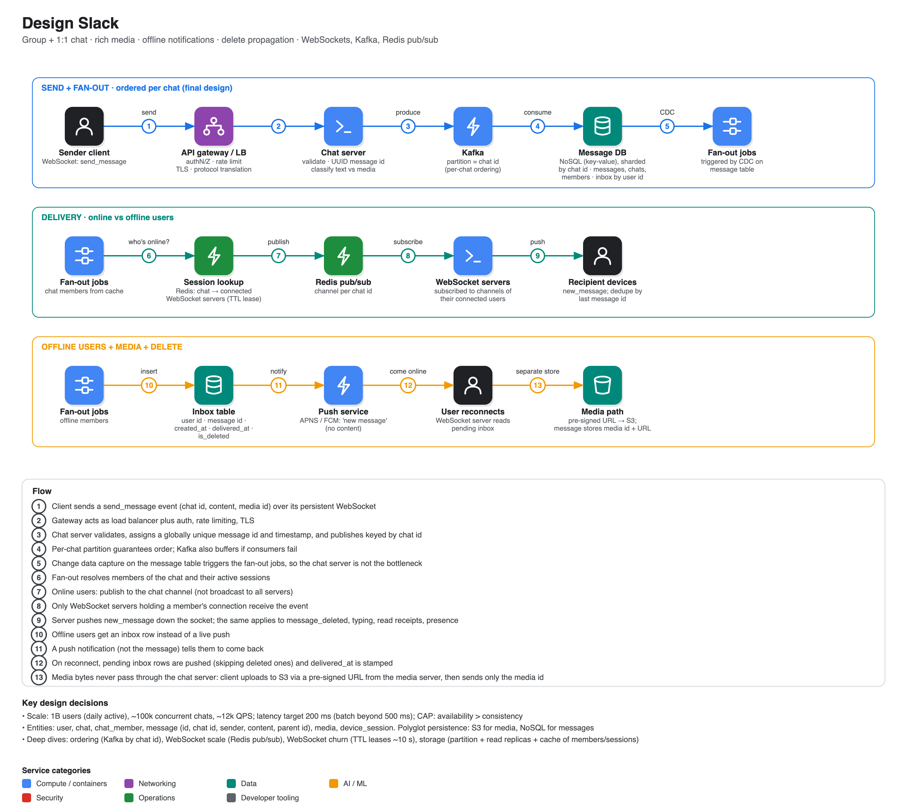

# Design Slack

**Source:** [System design expert deep dive: "Design Slack" (ex-Apple engineering manager)](https://www.youtube.com/watch?v=Zk15rDp31fk) · IGotAnOffer: Engineering · 52 min
**Presenter:** Saravanan, ~20 years building large distributed systems and security platforms (LinkedIn, Confluent, Adobe, Apple), now working on AI systems. This is a solo lecture rather than a back-and-forth mock interview.

## Structure he recommends for a design interview

Functional requirements → non-functional requirements (with numbers) → main entities → APIs → high-level design → deep dives (failure modes, scale). Keep requirements to ~12 minutes max; listen to the interviewer's signals about which section to pivot to (entities, high-level design, or estimation). Start with the simplest design: *"complexity should be earned by measured failure."*

## MVP scope (a "Slack-like" prompt is ambiguous; pick 3-4 features)

1. Send messages in one-to-one or group chats.
2. Send **rich media** (images, video, audio, files). This is where interviewers probe your storage choices (structured vs unstructured).
3. Real-time **notifications for offline users**.
4. **Delete** a message, propagated to all users and all of their devices.

Related events listed but not designed: typing indicator, read receipts, presence.

## Non-functional requirements (with numbers)

| | |
|---|---|
| Scale | 1B users (clarify daily vs monthly active), ~100k concurrent chats, ~12k QPS |
| Latency | < 200 ms per message (beyond 200 ms users notice; above 500 ms fall back to batching) |
| CAP | Partitions are unavoidable, so choose CP or AP. Chat = **availability over consistency**; financial/health data would choose consistency |
| Durability | Persist messages for audit/complaints and disaster recovery (RPO/RTO) |
| Multi-device | One user, several devices (some online, some offline); sends, receives, deletes and presence must sync across them |

## Entities

`user`, `chat` (group or 1:1), `message` (text or media reference), `media` (unstructured payload), `device_session` (active WebSocket or push endpoint per device).

## API: WebSockets, not REST

Request/response REST would force clients to poll. A **WebSocket** gives a persistent bidirectional connection (it starts as HTTP); server-sent events are one-way, so unsuitable. Events with payloads:

| Event | Direction |
|---|---|
| `send_message` | client → server |
| `new_message` | server → clients (the fan-out) |
| `delete_message` / `message_deleted` | client → server / server → clients |
| `typing_started` / `typing_stopped` / `user_typing` | both |
| `read_receipt`, `presence_update` | both |

Payload carries a server-assigned **globally unique message id**, chat id, content and metadata. Also touched on: microservices over SOA, SOLID/single responsibility, gRPC between services, REST/GraphQL externally.

## High-level design, flow by flow

1. **Send/receive:** client → API gateway (also the load balancer, plus auth, rate limiting, TLS) → **chat server** (validate, classify text vs media, generate message id with UUID, insert, optional per-chat sequence) → look up active users in the **WebSocket server** registry → push. Tables: `user`, `chat`, `chat_members`, `message` (`message_id`, `chat_id`, `sender_id`, `content`, `parent_message_id` for threads).
2. **Rich media:** client asks the **media server** for a **pre-signed URL** and uploads straight to **S3**; the message then carries `media_id` and `media_url` (a pointer). Polyglot persistence: relational/key-value for text, S3 for blobs.
3. **Offline users:** chat server sees who is not connected, inserts rows into an **`inbox`** table (`user_id`, `message_id`, `created_at`, `delivered_at`) and sends a **push notification** (APNS etc.) that says only "you have a new message". On reconnect the WebSocket server drains the inbox and stamps `delivered_at`; cleanup jobs purge delivered rows.
4. **Delete:** delete the row by message id, send `message_deleted` to online users, push a notification to offline ones; an `is_deleted` flag in the inbox makes sure a deleted message is never delivered later.

## Deep dives

1. **Message ordering.** Client timestamps are unreliable (clock skew). A server-side sequence counter per chat works but needs shared infrastructure and bottlenecks at scale. **Recommended: Kafka partitioned by chat id**, which preserves order within a chat, scales by adding partitions, buffers on failure, and redelivers to recovering consumers. The chat server publishes to Kafka; **fan-out jobs triggered by CDC** (or serverless functions) on the message table take over so the chat server is not the bottleneck.
2. **WebSocket scale and session lookup.** The WebSocket tier must not be a single point of failure. Use **Redis pub/sub** with a channel per chat id; each WebSocket server subscribes only to channels of chats its connected users belong to, so events are not broadcast to every server.
3. **WebSocket churn.** Users hop between nodes. Subscribing every server to every channel wastes resources; instead **lease subscription ownership with a Redis TTL** (about 10 s), so stale connections expire and no duplicate or ghost deliveries happen.
4. **Backend storage pressure.** Partition horizontally by **chat id** (messages) and **recipient user id** (inbox). **Write locally, read globally** with replicas across regions (the eventual-consistency requirement makes small lag fine). Prefer **NoSQL key-value** (write-optimised) unless you need relational joins. **Cache** rarely-changing lookups (chat members, device sessions, recent message slices), populated via CDC; caching ~10-20% of hot data can absorb ~80-99% of reads (his rule of thumb).
5. **Multi-device duplicates.** The client keeps the last received message id and ignores anything older, so replays after reconnects are harmless.

## Takeaways stated at the end

WebSockets are the heart of a chat design; Kafka for ordering; CDC-driven fan-out and Redis pub/sub to scale; TTL leases for session churn. Interviews typically go deep on two or three areas depending on the role and seniority.
