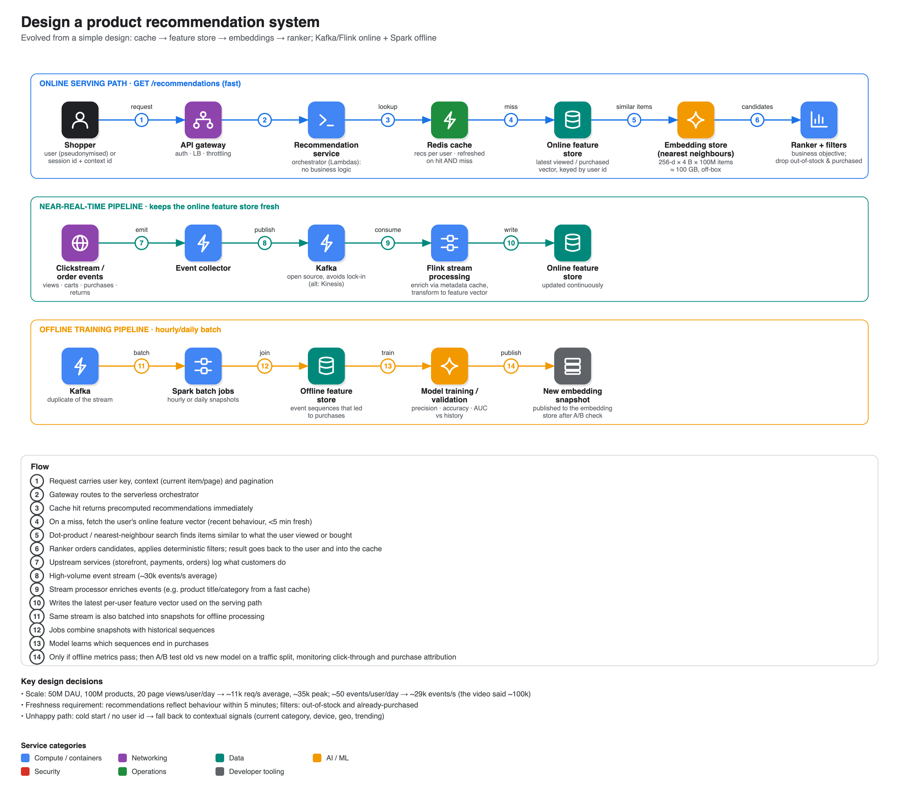

# Design a product recommendation system

**Source:** ["Design a product recommendation system": Amazon Principal Engineer aces ML system design interview](https://www.youtube.com/watch?v=mh0i-vtONi8) · IGotAnOffer: Engineering · 51 min
**Presenter:** Evan Zang, principal engineer, ~15 years across AI/NLP, telecom, fintech, advertising and retail, 9 years at Amazon (mostly as a Bar Raiser). A solo walkthrough on Excalidraw rather than a back-and-forth mock.

## 1. Requirements: put a product hat on first

Questions to ask, in three groups:

- **Product / functional:** what kind of recommendations (similar items on an e-commerce site vs a social feed)? Any filtering?
- **Scale:** how many users and items?
- **Data:** how fresh must recommendations be?

Answers used:

| | |
|---|---|
| Type | **Item-to-item** (similar items) plus **user-personalised** recommendations on an e-commerce site |
| Scale | **50M daily active users**, **100M products** |
| Freshness | Reflect recent behaviour within **5 minutes** |
| Filters | Remove **out-of-stock** and **already purchased** items |

## 2. Back-of-envelope numbers

| | |
|---|---|
| Requests | 50M × 20 page views ÷ 86,400 s ≈ **11k req/s** average, ~**35k** peak |
| Events | 50M × 50 events ÷ 86,400 s ≈ **29k events/s** average (the video says "almost 100,000/s", which overstates it) |
| Embedding index | 100M items × 256 dimensions × 4 bytes ≈ **100 GB**, so keep it off the service boxes, in dedicated infrastructure or cache |

A recommendation prompt is the cue to size the ML components too.

## 3. Evolving the design from simple

His philosophy: **start simple, trace one request end to end, and let the bottleneck drive the next step.**

1. **v1:** user → API gateway (+ load balancer) → recommendation service (serverless Lambdas, chosen for low ops overhead) → item catalog DB + user history → heuristic recommendation. *Bottleneck:* fetching items and comparing with history on every request is expensive, and relevance is unknown.
2. **Add Redis cache** of recommendations per user (performant, local plus distributed, daily snapshot backups). *Miss path needs something better than v1.*
3. **Add an online user feature store** (keyed by user id) returning a vector of the latest viewed/purchased items, instead of the full history.
4. **Add an embedding store with nearest-neighbour search.** Embeddings are vectors representing similarity between products or behaviours; a dot-product against the item matrix finds similar items quickly.
5. **Split responsibilities (single responsibility principle).** The recommendation service becomes an **orchestrator**; a separate **ranker** orders candidates for a business objective and applies **filters** (out-of-stock, purchased). Beware an "uber service".
6. A dotted line writes the result back to the cache (and says when the cache is refreshed).

## 4. Data pipeline behind the ML pieces

- **Near-real-time:** services emit events (views, orders, payments, returns) → event collector → **Kafka** (open source and no vendor lock-in, even though API Gateway/Lambda chose AWS; **Kinesis** is the managed alternative) → **Flink** stream processing, enriching events from a metadata cache and transforming them into the online feature vector → online feature store.
- **Offline batch:** the same stream is duplicated to **Spark** jobs running hourly/daily on snapshots plus an **offline feature store** of event sequences that led to purchases. The model is trained and validated against history (precision, accuracy, area under the curve); passing weights produce the next **embedding snapshot** to publish.

## 5. Deep dives

- **APIs and schemas.** `GET /recommendations` keyed by a pseudonymised user id, with a contextual id for the current item, plus pagination. Event payload: `user_id, item_id, event_type, timestamp, session_id`. Choose the primary key deliberately (user id vs session id for anonymous users); handle hyper-active users with finer partitioning to avoid hot partitions, or change the key.
- **Freshness vs cost trade-off.** The 5-minute requirement means not recomputing per request: lean on caching. Pick a batch cadence (hourly, six-hourly, daily, weekly) by comparing cost and measured business impact; a weekly run over a week of data may be infeasible, not cheaper.
- **Cache refresh on a hit.** Refresh the cache on **hits** as well as misses: a hit means the user is active, and the online features keep changing.
- **Unhappy paths / graceful degradation.** Cold start, logged-out user, cache not updating, feature store empty: fall back to **contextual signals** (category of the current page, device type, geolocation, trending or weather-appropriate items).
- **Testing ML in production.** Offline metrics are not enough: **A/B test** the old vs new model with traffic splitting and group labelling in logs. Track **business metrics** (click-through, purchase attribution) by joining recommendation logs with later clicks. Do not get pulled into designing another whole system while discussing this.

## Closing patterns he calls out

- Present both a **precomputed** side and a **fast request-serving** side, and both **offline batch** and **real-time** pipelines.
- Show **graceful degradation**.
- Clarify product requirements, not only technical ones.
- Pressure-test unhappy paths, not only the ideal path.
