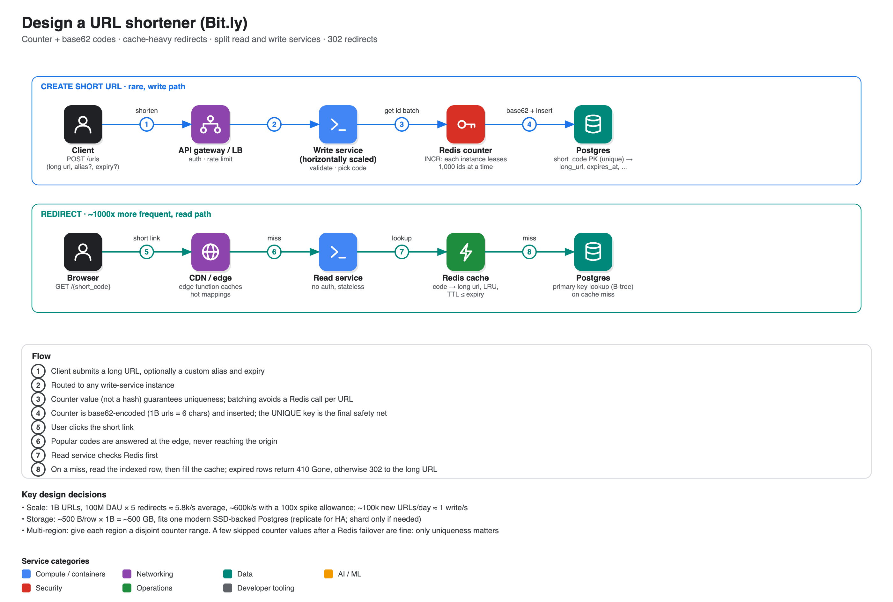

# Design a URL shortener (Bit.ly)

**Source:** [Hello Interview written breakdown: Bit.ly](https://www.hellointerview.com/learn/system-design/problem-breakdowns/bitly) (Evan King, Hello Interview; the page also links a video walkthrough). This summary is from the article, not from watching the video.
**Level of the question:** entry-level, but a good test of depth.

## Scope

- **In:** shorten a long URL (optional custom alias, optional expiry), redirect a short URL to the original.
- **Out:** accounts, click analytics, spam/malicious-URL filtering.
- **Non-functional:** unique codes, redirect in under 100 ms, 99.99% availability (**availability over consistency**), 1B URLs and 100M DAU.
- **Key observation:** roughly **1,000 reads for every write**, which drives caching, DB choice and the read/write split.

## API

- `POST /urls {long_url, custom_alias?, expiration_date?}` → `{short_url}`
- `GET /{short_code}` → HTTP **302** redirect (an expired link returns **410 Gone**).

**301 vs 302:** a 301 is cached permanently by browsers, so you lose control (cannot expire/change a link, cannot count clicks). 302 keeps every request flowing through you. (The article's comment section debated this; the consensus is that a URL shortener is an indirection service, so keep control.)

## Making short codes unique

| Approach | Verdict |
|---|---|
| Prefix of the long URL | Bad: different URLs collide |
| **Hash** (SHA-256 on the canonicalised URL, base62-encode, keep 8 chars) | Great, but collisions are possible as the table fills; needs a UNIQUE constraint and bounded retries with a salt. Deterministic hashing also makes the same long URL map to the same code, which you may not want (separate expiry, analytics, aliases) |
| **Counter + base62** | Great: no collisions. A Redis `INCR` is atomic and single-threaded; 1B ids is only 6 base62 chars (`15ftgG`), and 62⁷ exceeds 3.5 trillion |

Counter caveats: codes become **predictable** (enumeration; also reveals your volume). Mitigate with a reversible shuffle (XOR with a secret, or a fixed-width block cipher) or accept it since shortened URLs are usually public. Keep custom aliases from colliding with generated codes by reserving a prefix or namespace.

## Making redirects fast

1. **Index**: short code as primary key (B-tree) instead of a full table scan. Necessary but not enough: ~600k reads/s at spike would overwhelm one database.
2. **Redis/Memcached cache** (memory ≈ 100 ns vs SSD ≈ 0.1 ms vs HDD ≈ 10 ms). Use LRU eviction and a TTL no longer than the URL's expiry. Cold start after a restart still hits the DB.
3. **CDN plus edge compute** (Cloudflare Workers, Lambda@Edge): popular redirects never reach the origin. Trade-offs: invalidation across PoPs, cost, function limits, harder debugging.

## Scaling

- Data is small: ~200-500 bytes per row × 1B ≈ **500 GB**, within one SSD-backed Postgres. Writes are ~1/s, so almost any database works ("pick what you know; Postgres if unsure"). Replicate for availability; snapshot backups.
- **Split the read service and the write service** and scale each horizontally.
- Multiple write instances need one source of truth for the counter: central **Redis counter with batching** (each instance reserves e.g. 1,000 values at a time, so Redis is hit rarely and is nowhere near its 100k+ ops/s capacity). Use Sentinel or Cluster for failover. Losing a few values on failover is harmless because only uniqueness is needed and the DB's UNIQUE constraint backs it up.
- **Multi-region:** give each region a disjoint counter range (region A 0-1B, region B 1B-2B) to avoid cross-region coordination.
- Alternatives raised in the discussion: Postgres sequences or DynamoDB for the counter; Snowflake-style ids (but 11-character codes instead of ~7).

## What each level is expected to show

- **Mid:** working create/redirect flow, a uniqueness strategy, why 302, basic indexing, caching with a nudge.
- **Senior:** drive the conversation, hashing vs counter trade-offs, cache invalidation for expiry, DB choice with justification, read/write split, scaling the counter.
- **Staff+:** see past the textbook; multi-region counter ranges, Redis-failover behaviour, security implications of predictable codes, alias collisions, expiry clean-up, and how it evolves.
