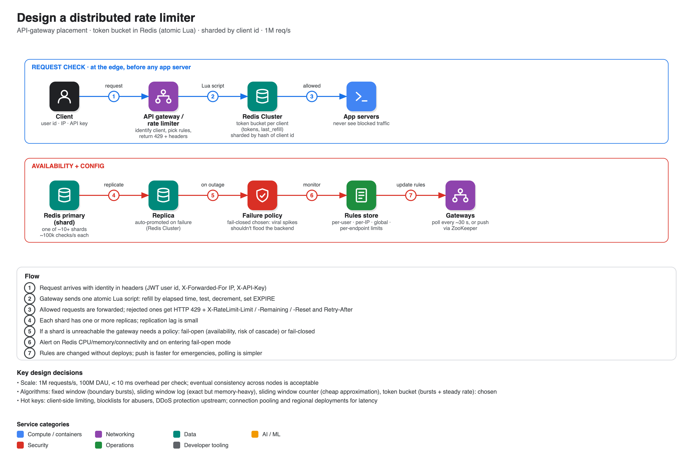

# Design a distributed rate limiter

**Source:** [Hello Interview written breakdown: Distributed Rate Limiter](https://www.hellointerview.com/learn/system-design/problem-breakdowns/distributed-rate-limiter) (Hello Interview; the same problem is also covered in their ex-Meta staff engineer video and in ByteByteGo's chapter "Design a Rate Limiter"). Summary is from the article.

## Scope

- Request-level, **server-side** limiter for a social-media API.
- **Functional:** identify clients by user id, IP or API key; enforce configurable rules (e.g. 100 requests/minute/user); reject excess with **HTTP 429** and helpful headers.
- **Out of scope:** analytics on limiter data, long-term persistence, strong cross-node consistency.
- **Non-functional:** < 10 ms added latency, highly available (eventual consistency OK), **1M requests/s across 100M DAU**.
- Interface: `isRequestAllowed(clientId, ruleId) → {passes, remaining, resetTime}`.
- Entities: Rules, Clients, Requests.

## Where to put it

| Placement | Verdict |
|---|---|
| **In-process** (each app server counts locally) | Bad: each server sees only a fraction of traffic; limits drift by the server count |
| **Dedicated service** (app asks "may I?") | Good: global state and rich context (plan tier, endpoint), but adds a network hop to every request and a new failure point |
| **API gateway / load balancer** | **Great, chosen:** blocks at the edge so app servers never see rejected traffic. Limitation: only request data (headers, URL, IP, token) is visible, so encode plan tier in the JWT if needed |

Layered rules are normal (per user, per IP, global, per endpoint); enforce the most restrictive.

## Algorithms

| Algorithm | Notes |
|---|---|
| Fixed window counter | Simplest; boundary bursts (100 at 12:00:59 plus 100 at 12:01:00) |
| Sliding window log | Exact; stores every timestamp, memory-heavy |
| Sliding window counter | Weighted previous + current windows; cheap approximation assuming even traffic |
| **Token bucket (chosen)** | Bucket size = burst allowance, refill rate = sustained rate; state is just `(tokens, last_refill)`. What Stripe uses. Watch the cold-start full bucket |

## State in Redis, and the race

Gateways must share state, so keep each client's bucket in **Redis**: `HMGET` the bucket, compute refill, `HSET` the new values, `EXPIRE` after an hour of inactivity. A `MULTI/EXEC` block alone is **not** enough: the read happens outside the transaction, so two gateways can both see one token and both allow. Fix: do read-compute-write inside **one Lua script**, which Redis runs atomically (widening the atomic boundary to the whole read-modify-write).

## Response

Fail fast with **429** rather than queueing (queues eat memory, invite retries, make latency unpredictable). Include `X-RateLimit-Limit`, `X-RateLimit-Remaining`, `X-RateLimit-Reset` and `Retry-After` so clients can back off.

## Deep dives

1. **Scale to 1M req/s.** One Redis does maybe 50-100k checks/s, since each check needs several operations. Shard by client identifier with **consistent hashing**, so each client's state lives on exactly one shard (~10 shards). In practice use **Redis Cluster** (16,384 hash slots) instead of hand-rolled routing.
2. **Availability and failure mode.** Replicas per shard with automatic promotion. If Redis is unreachable choose: **fail-open** (stays up, but if Redis died because of a traffic spike, you now send all of it downstream: cascading failure) or **fail-closed** (protects the backend, but takes the API offline and invites aggressive retries). For a social platform they choose **fail-closed**; payment systems also tend to. Add monitoring and an alert when fail-open is triggered.
3. **Latency.** Connection pooling (avoids 20-50 ms TCP setup) and regional gateways + Redis (tolerate eventual consistency between regions). Local caching of counters, pipelining and batching are possible but risky/unnecessary.
4. **Hot keys.** Legitimate heavy clients: client-side limiting (SDKs that honour the headers), batching, premium tiers. Abuse: auto-block after repeated violations (blocklist in one shard), upstream DDoS protection (Cloudflare, AWS Shield). Set higher per-IP limits because of NATs and shared Wi-Fi.
5. **Dynamic rules.** Poll a config store every ~30 s (simple, delayed) or push via **ZooKeeper**/pub-sub (fast, more complexity; justified for incident response).

## Related reading from the same research

ByteByteGo's chapter walks the same ground with leaky bucket and Redis `INCR`/`EXPIRE` counters, and the Jordan Has No Life and TechPrep videos give shorter takes (see [ROADMAP.md](../ROADMAP.md)).
