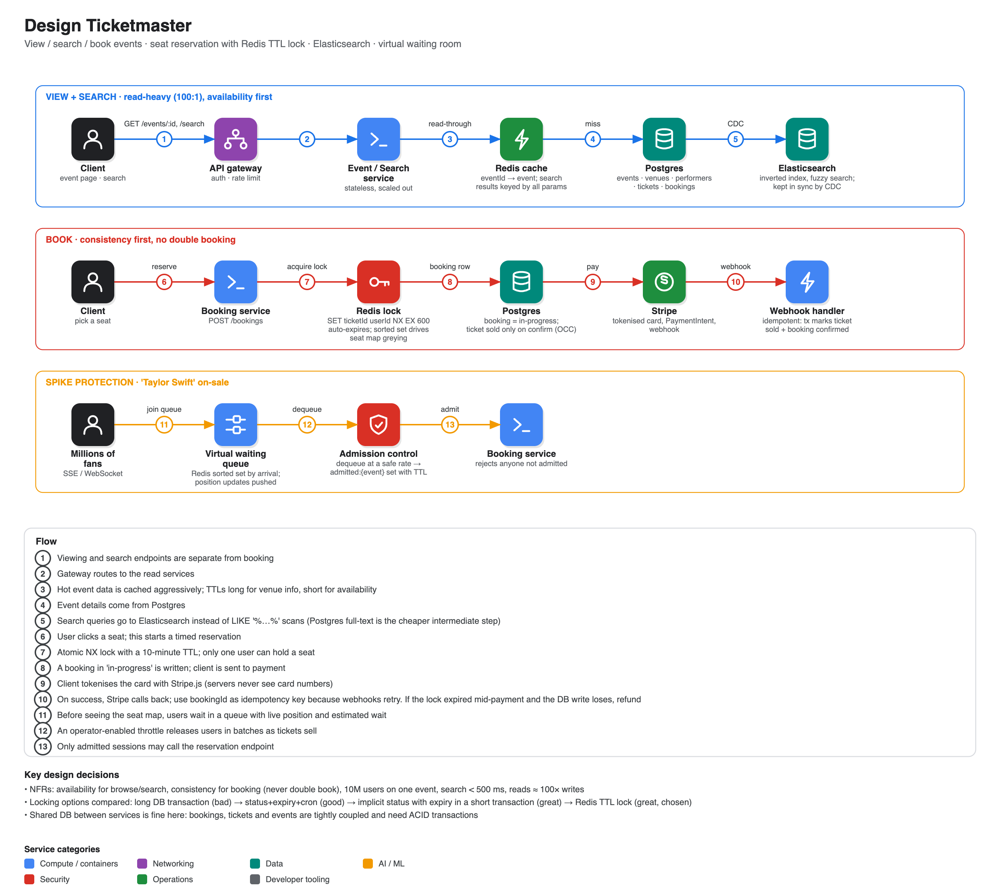

# Design Ticketmaster

**Source:** [Hello Interview written breakdown: Ticketmaster](https://www.hellointerview.com/learn/system-design/problem-breakdowns/ticketmaster) (Hello Interview, by an ex-Meta staff engineer; there is also a long-running video of the same problem). Summary is from the current article.

## Scope

- **In:** view events, search events, book tickets.
- **Out:** a user's booking history, admin event creation, dynamic pricing.
- **Non-functional:** prioritise **availability for browsing/search** but **consistency for booking** (no double booking); handle 10 million users on one event; search < 500 ms; read-heavy (~100:1).

## Entities

Event, User, Performer, Venue (with a seat map), Ticket (one per seat per event: section/row/seat, price, status), Booking (groups tickets in one order with status and total).

## API

- `GET /events/:eventId` → event + venue + performer + tickets (the tickets render the seat map).
- `GET /events/search?keyword&start&end&pageSize&page`.
- `POST /bookings/:eventId {ticketIds[], paymentDetails}` → `bookingId`. Evolves into reserve + confirm.

## High-level design (built requirement by requirement)

1. **View:** client → API gateway → Event Service → Events DB.
2. **Search:** a Search Service querying the DB (improved later).
3. **Book:** a Booking Service with Bookings and Tickets tables in **Postgres** (ACID; use proper isolation plus row locking or optimistic concurrency control) and Stripe for payment. The initial flaw: a user can fill in payment details and *then* learn the seat is gone. A shared database across services is acceptable here because the data is tightly coupled and needs ACID; don't recite "database per service" as dogma.

## Deep dives

### 1. Reserving a seat while the user pays

| Approach | Verdict |
|---|---|
| Long-running DB lock (`SELECT FOR UPDATE` held for minutes) | **Bad**: strains the DB, deadlocks, locks leak if the app crashes |
| Status + expiry timestamp + cron sweeper | Good, but seats stay unavailable until the sweeper runs, and if the sweeper fails nothing frees up |
| **Implicit status**: ticket is available if `AVAILABLE` or (`RESERVED` and expired); claim it in a short transaction | Great: no dependence on a sweeper; slightly slower reads (use a compound index/materialised view) |
| **Redis distributed lock with TTL** (`SET ticketId userId NX EX 600`) | **Great, chosen**: atomic, auto-expiring, fast. Ticket table then needs only available/booked |

Details worth saying out loud for the Redis approach:
- **Seat-map display:** a plain Redis set of locked ids leaves "ghost" entries when locks expire, so use a **sorted set scored by expiry time**, count only future-dated entries, and trim stale ones lazily. Alternative: write "reserved" through to the DB and sweep periodically.
- **If the lock service dies:** you still never double book because the DB uses OCC/row locking; users may just get a late error. Better than every ticket looking unavailable.
- **TTL expires mid-payment:** the DB transaction fails for one of the two users; refund the loser via Stripe. Set TTL generously and extend it when payment starts.
- **Flow:** seat click → `POST /bookings` → lock for 10 minutes + in-progress booking → payment page → Stripe.js tokenises the card (PCI) → PaymentIntent → **webhook** → transaction marks ticket sold and booking confirmed. Webhooks retry, so make the handler **idempotent** (bookingId as idempotency key, check current status).

### 2. Scaling the view API for tens of millions of requests

Cache event, venue and performer data in Redis/Memcached (read-through, TTLs by volatility, invalidation on change), keep services stateless and scale horizontally, and use round-robin/least-connections load balancing.

### 3. Good experience for a mega-event

- **Server-sent events** push live seat availability. Fine for moderately popular events, but for a "Taylor Swift" on-sale the seat map empties instantly and users are overwhelmed.
- **Great: virtual waiting queue.** Before they see the seat map, users join a queue (Redis sorted set by arrival time) with a persistent SSE/WebSocket connection pushing their position. Dequeue periodically or as tickets sell and mark users admitted in an `admitted:{event}` set with a TTL. The Booking Service rejects anyone not admitted. Insight: the staff-level answer here is a product/flow fix, not more infrastructure.

### 4. Low-latency search

`LIKE '%Taylor%'` scans the table. Options: indexes and query tuning (limited for partial matches) → **Postgres full-text** (tsvector + GIN) → **Elasticsearch** (inverted index, fuzzy matching for typos), fed from Postgres by **CDC**. Cost: sync complexity and another cluster.

### 5. Repeated search queries

Cache result sets in Redis keyed by every search parameter with a TTL; use Elasticsearch's own shard-level query and request caches; use CDN caching if results are not personalised. Hard part: invalidating cached results when a new event appears.

## Expected at each level (from the article)

- **Mid:** API and data model, functional view/book, and the status + timeout + cron approach.
- **Senior:** speed through the basics; Elasticsearch for search, a distributed lock for reservations, scaling and replication detail.
- **Staff+:** deep dives into 2-3 areas with real-world experience; ideally teaches the interviewer something.
