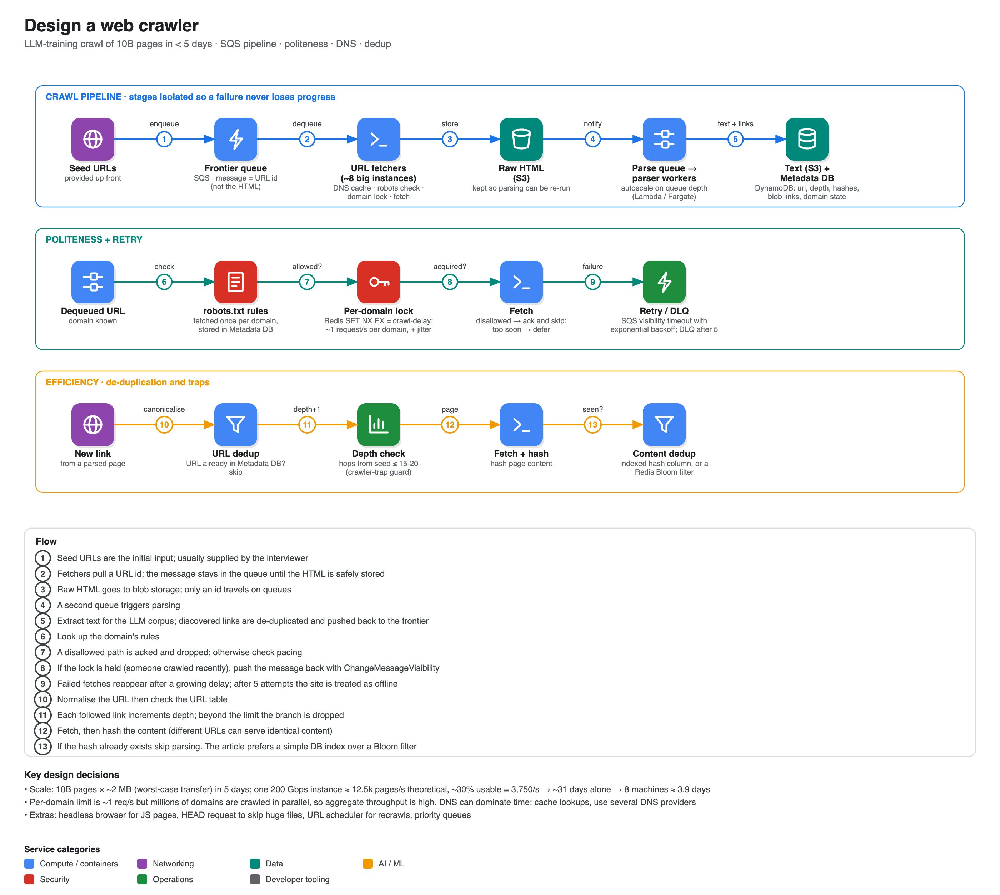

# Design a web crawler

**Source:** [Hello Interview written breakdown: Web Crawler](https://www.hellointerview.com/learn/system-design/problem-breakdowns/web-crawler) (Hello Interview; a video walkthrough of the same question exists on their channel). Summary is from the article.

## Scope

- Crawl from **seed URLs**, extract **text** per page and store it, in this telling to train an LLM (a search engine would also index and rank).
- **Out:** text processing/training, images and video, JavaScript-rendered pages, login-required pages. You can't reach every page ("dark corners").
- **Non-functional:** fault tolerance (resume without losing progress), **politeness** (robots.txt, no overload), efficiency (**10B pages in under 5 days**), scalability. Average ~2 MB per page transferred (HTML alone is ~30 KB).
- Not user-facing, so define the **system interface** (input: seeds; output: text) and the **data flow** instead of an API: take URL → resolve DNS → fetch HTML → extract text → store → extract links → repeat.

## Simple design

Frontier queue (SQS/Kafka/Redis) → crawler → DNS → web server → S3 for text.

## Deep dives

### 1. Fault tolerance: split into pipeline stages

The one fat crawler does DNS + fetch + parse + link extraction, so any failure loses everything and everything scales together. Break it into **URL Fetcher** (store raw HTML in blob storage) and **Text & URL extraction** (parser workers). Add a **Metadata DB** (DynamoDB) with URL status and links to the HTML/text blobs. **Never put big payloads on a queue**: messages carry the URL's id. Bonus: when requirements change (say include image alt text) you re-run parsing without re-fetching the web.

**Retries for failed fetches:**

| Approach | Verdict |
|---|---|
| In-memory timer | Bad: lost if the crawler dies, and the failure rarely clears in seconds |
| Kafka with manual backoff topics | Good but complex to build and maintain |
| **SQS with exponential backoff** | **Great, chosen:** use the visibility timeout, adjusting it with `ChangeMessageVisibility` based on `ApproximateReceiveCount`, and a redrive policy that sends the message to a **dead-letter queue** after N tries (5 here) |

**If a crawler dies mid-fetch:** the URL stays in the queue until confirmed (Kafka: the consumer offset isn't advanced; SQS: the message reappears after the visibility timeout; delete only after the HTML is stored). Same for parser workers.

### 2. Politeness: robots.txt and rate limits

- Download and store each domain's **robots.txt** (rules: `Disallow`, `Crawl-delay`, which isn't official and Googlebot ignores it, but is polite to follow).
- For each dequeued URL check the rules: disallowed → ack and drop; allowed but crawled too recently → defer with `ChangeMessageVisibility` (`DelaySeconds` only works for newly sent messages).
- Multiple crawlers can race on the same domain, so use an **atomic per-domain lock** (`Redis SET NX` with TTL = crawl delay).
- Cap at **~1 request/second per domain** using a shared Redis counter (sliding window). To avoid crawlers retrying in lock-step, add **jitter**.

### 3. Scale to 10B pages in < 5 days

- I/O-bound. A network-optimised instance (≈200 Gbps) gives 200 Gbps ÷ 8 ÷ 2 MB ≈ 12,500 pages/s in theory; assume 30% usable ≈ **3,750 pages/s**. Time on one machine ≈ 31 days, so **8 machines ≈ 3.9 days**. Validate with load tests in real life.
- The 1 request/s per-domain cap does not limit throughput, because you crawl millions of domains at once with thousands of concurrent connections per machine.
- **Parser workers**: scale on queue depth (Lambda or ECS Fargate).
- **DNS** is an often-missed bottleneck (research found up to ~70% of a thread's time went to lookups before custom resolvers): cache lookups in crawlers and use several DNS providers round-robin (a staff candidate's practical idea).
- **URL-level dedup:** check the URL table before enqueueing. **Content-level dedup:** hash the fetched content (different URLs and domains can serve identical pages); either an **indexed hash column** in the Metadata DB (the article's preference) or a **Bloom filter** (Redis RedisBloom `BF.ADD/BF.EXISTS`; probabilistic, false positives mean skipping a page that wasn't really seen). The author calls the Bloom filter "a bit overkill" but notes candidates always raise it.
- **Crawler traps** (self-linking or infinite link generators): store link-hop **depth** from the seed and stop beyond a threshold (15-20).

## More deep dives to consider

JavaScript-heavy sites (headless browser such as Puppeteer), monitoring (CPU, queue depth, failure rates), skipping huge files with an HTTP `HEAD` and `Content-Length`, **continuous recrawling** via a URL Scheduler (by last crawl time/popularity), and **priority crawling** (multiple SQS queues or Kafka topics per priority).

## Expected at each level (from the article)

- **Mid:** the data flow, a simple working crawler, basics of politeness.
- **Senior:** politeness in detail, scaling and meeting the 5-day target, queue behaviour.
- **Staff+:** 3+ deep dives with practical depth; the interviewer should learn something.
