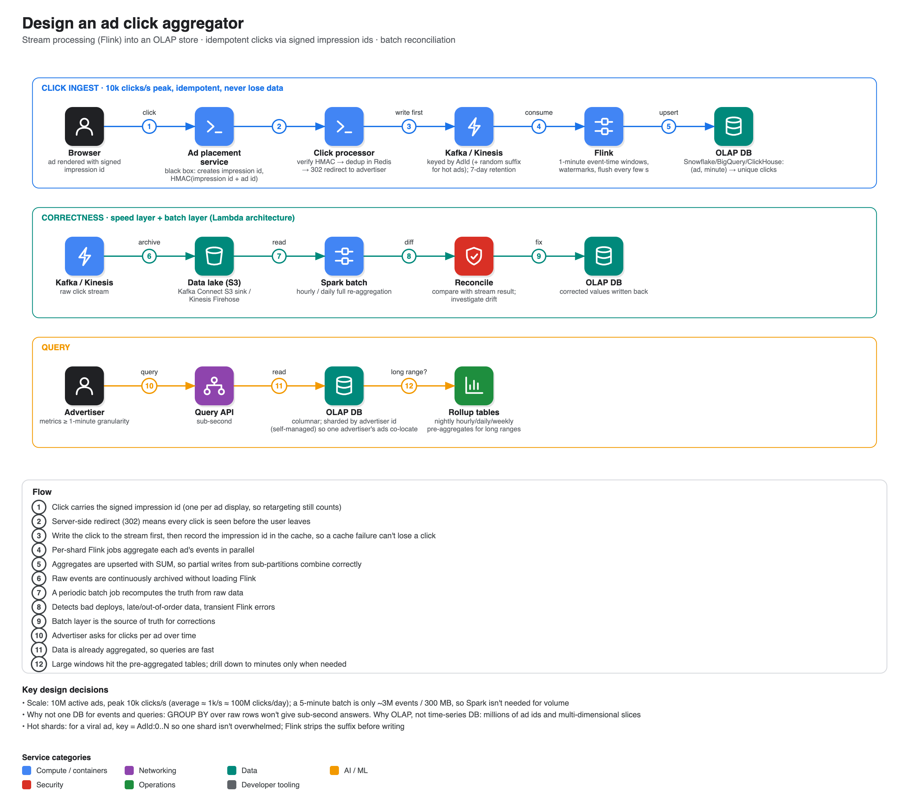

# Design an ad click aggregator

**Source:** [Hello Interview written breakdown: Ad Click Aggregator](https://www.hellointerview.com/learn/system-design/problem-breakdowns/ad-click-aggregator) (Hello Interview; the page links a video walkthrough). Summary is from the article. A good companion to [06 Google Ads](../06-google-ads/), which tackles the click-score feedback loop instead.

## Scope

- **In:** a user clicks an ad and is redirected to the advertiser; advertisers query click metrics at **≥ 1-minute granularity**.
- **Out:** ad targeting and serving, cross-device tracking, offline channels, fraud detection, geo/demographic profiling, conversion tracking.
- **Scale:** 10M active ads, **peak 10k clicks/s** (average ~1k/s, ~100M clicks/day).
- **Non-functional:** scalable, **sub-second analytics queries**, fault tolerant with **no lost clicks**, as real-time as possible, **idempotent** (one click counted once).
- Interface: input = ad clicks; output = ad click metrics.

## Redirecting

- **Client-side** (ad carries the target URL; browser also POSTs to `/click`): simple, but clicks can bypass tracking.
- **Server-side (chosen):** the click hits your `/click` endpoint, you record it, then respond with a **302** to the advertiser. Every click is observed, and you can add tracking parameters. Cost: extra latency and load to handle.

## Aggregating the data

| Approach | Verdict |
|---|---|
| One database for raw events and `GROUP BY` queries | Bad: won't give low latency at 10k writes/s |
| Event store (Cassandra, LSM-tree based and write-optimised) + **Spark batch** every N minutes + **OLAP** store (Redshift/Snowflake/BigQuery) | Good: pre-aggregated reads are fast. Delay of minutes; a spike can make the next batch run longer than its interval and fall further behind |
| **Stream** (Kafka/Kinesis) → **Flink** → OLAP | **Great:** event-time windows, watermarks for late/out-of-order events, exactly-once guarantees, fault-tolerant state. Windowed counts flush every few seconds |

Notes from the article:
- Why Flink and not plain consumers with an in-memory count? You'd have to rebuild event-time semantics, watermarks, exactly-once and state recovery yourself.
- The latency of batch vs stream is similar if both use 1-minute windows, but you can shrink Flink's flush interval to seconds, whereas running Spark jobs that often is impractical.
- 300 MB per 5-minute batch is small enough for one machine; Spark is used because it distributes if data grows and is easy to explain.
- Why OLAP and not a time-series DB: high-cardinality ad ids and future slicing by device, geography, campaign. A TSDB is reasonable only for simple time-range queries.

## Deep dives

1. **Scale to 10k clicks/s.** Click processor scales horizontally behind a load balancer. The stream is sharded by **AdId** (Kinesis shards cap at 1 MB/s or 1,000 records/s). One Flink job per shard. OLAP: managed warehouses scale automatically; self-managed (ClickHouse) shard by advertiser id.
   - **Hot shards:** a viral ad overloads its shard. Append a random suffix to the key for popular ads (`AdId:0..N`), and have Flink strip it before upserting with SUM.
2. **No lost clicks.** Streams replicate across brokers/AZs and retain data (e.g. 7 days) so a failed processor can replay. Flink checkpointing is usually unnecessary for 1-minute windows: you lose at most a minute and can replay (pushing back on reflexive "checkpoint it" answers is a seniority signal). Add **reconciliation**: dump raw events to a data lake (S3 via Kafka Connect/Firehose) and have a periodic Spark batch re-aggregate and compare. This combination is the **Lambda architecture** (speed layer for latency, batch layer for correctness).
3. **Idempotency / abuse.**
   - Bad: dedupe on `userId + adId` (needs login; also wrong for retargeting where the same user legitimately sees the ad repeatedly).
   - **Great:** the Ad Placement Service issues a unique **impression id** per display; the click carries it and you dedupe on it. De-dupe **before** the stream (Flink windows can't dedupe across minute boundaries). Prevent forged ids by signing `impressionId + adId` with an **HMAC**; verifying costs microseconds. Order matters: verify → check cache → **write to stream first** → add to cache, so cache failure causes at most a duplicate (caught in reconciliation), never a lost click. Cache size is tiny (100M × 16 bytes ≈ 1.6 GB); use Redis Cluster with replica and persistence.
4. **Low-latency queries.** Mostly solved by pre-aggregation. For long ranges (weeks, years) add rollup tables (hourly, daily, weekly) built nightly, trading storage for speed, like a cache.

## Expected at each level (from the article)

- **Mid:** recognise the need for pre-aggregation and propose at least batch processing; reason about idempotency and DB choice with prompting.
- **Senior:** contrast real-time with batch, justify technologies, pick a few deep dives.
- **Staff+:** weigh batch vs stream trade-offs in depth, a fault-tolerant design, storage strategy implications; teach the interviewer something.
