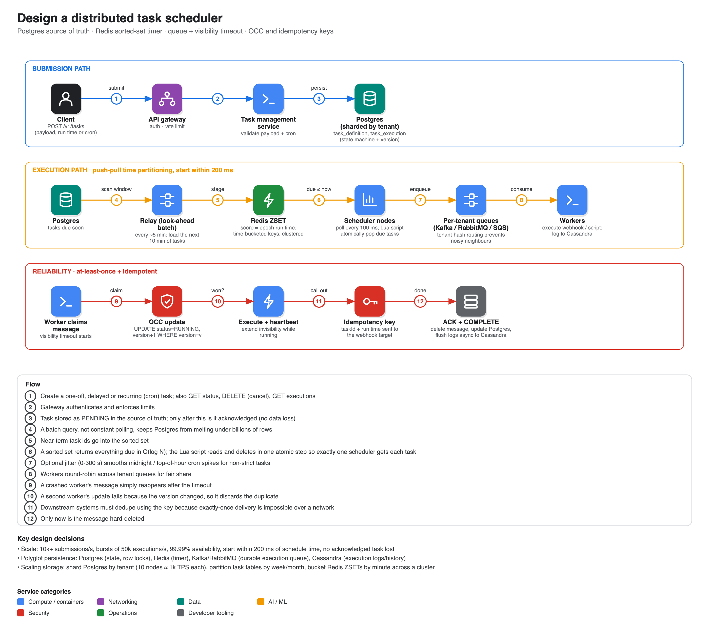

# Design a distributed task scheduler

**Source:** [Distributed Task Scheduler: System Design Interview](https://www.youtube.com/watch?v=zl8BPH74GY4) · TechPrep · ~21 min. Read from the transcript. (Hello Interview has a similar problem breakdown, [Job Scheduler](https://www.hellointerview.com/learn/system-design/problem-breakdowns/job-scheduler), but its body is Premium-only so it is not summarised here.) The presenter also promotes TechPrep's paid write-ups; ignore that, the design content stands on its own.

## Requirements

- **Functional:** submit one-off, delayed or recurring (cron) tasks; the system runs the payload (HTTP webhook, script, or message push) at the scheduled time; query status (pending, running, completed, failed, cancelled); cancel an upcoming task; keep execution history and logs for audit.
- **Non-functional:** **10,000+ submissions/s** and bursts of **50,000 executions/s**; 99.99% uptime for submission and routing; **no data loss** once a task is acknowledged; tasks start within **200 ms** of their time.

## Data model (polyglot persistence)

| Store | Use |
|---|---|
| **Postgres** | Source of truth: `task_definition` (payload, retry policy, cron/one-off) and `task_execution` (a state machine: pending → queued → running → success/failed, with an idempotency key and timestamps). Relies on ACID and row locks |
| **Redis** | High-speed timer buffer using **sorted sets** whose score is the epoch run time |
| **Kafka / RabbitMQ** | Durable execution queue; absorbs spikes (back-pressure) between scheduler and workers |
| **Cassandra** | Wide-column store only for execution logs; one recurring task can create millions of rows |

## API

`POST /v1/tasks` (payload, run time or cron, target) → task id · `GET /v1/tasks/{id}` · `DELETE /v1/tasks/{id}` (cancel pending) · `GET /v1/tasks/{id}/executions` (paginated history).

## Architecture

- **Submission:** client → gateway (auth, rate limit) → task management service (validates payload and cron) → Postgres with status pending. Very near-term tasks (say the next 15 minutes) can also be put straight into the Redis timer.
- **Execution:** a **relay** batch wakes every ~5 minutes, queries Postgres for tasks due in the next ~10 minutes, and stages their ids in the Redis ZSET. A fleet of lightweight **scheduler nodes** polls Redis every ~100 ms for tasks with score ≤ now and pushes them to the queue. Workers consume, execute the webhook, update Postgres, and write logs to Cassandra.
- **Noisy neighbours:** route tasks to **per-tenant queues** (hash of tenant id) and have workers round-robin, so one customer submitting 50k tasks doesn't starve others.

## Deep dives

1. **Redis sorted sets.** Internally a hash map (O(1) lookup by task id for cancel or "when does this run?") plus a **skip list** (O(log N) range by time). Polling descends the skip list's express lanes past far-future tasks and returns the sorted prefix that is due.
2. **High-precision scheduling without hammering the database.** Push-pull time partitioning: batch look-ahead from Postgres, sub-second polling in memory. Use a **Lua script** so a read-and-delete of due tasks is atomic (Redis executes it as one indivisible step on its single-threaded loop), guaranteeing each task goes to exactly one scheduler. Add optional **jitter** (e.g. 0-300 s) for non-strict tasks to spread top-of-the-hour cron spikes (thundering herd).
3. **Worker fault tolerance.** Use broker visibility timeouts and explicit acks (SQS/RabbitMQ style): a pulled message is hidden (`invisible_until`) and has a receipt handle; workers send **heartbeats** to extend the timeout on long jobs; on success they ack with the receipt handle and the message is permanently deleted; if a worker crashes the message reappears and another worker takes it.
4. **Execution guarantees.** Retries imply **at-least-once**; exactly-once over an unreliable network is impossible, so make duplicates harmless:
   - **Optimistic concurrency control:** before executing, `UPDATE ... SET status='running', version=version+1 WHERE status='pending' AND version=v`; a duplicate worker's update fails and it discards the message.
   - **Idempotency key** (task id + execution timestamp) injected into outbound webhook headers so the downstream system can ignore repeats.
5. **Scaling storage.** A single Postgres primary near 10k TPS shows latency spikes and lock contention: **shard by tenant id** (10 nodes ≈ 1k TPS each) so a tenant's data stays local, and **partition task tables by week/month** to drop or archive old partitions cheaply and keep the active index small. A single huge sorted set blocks Redis's event loop, so use **time-bucketed keys** (e.g. per minute) spread across a Redis Cluster.

## Notes

- The video is TechPrep's and is framed as interview prep; the numbers (200 ms, 50k bursts) are the stated requirements, not measurements.
- The same building blocks (Postgres source of truth, queue, visibility timeout, idempotency) reappear in [20 Web crawler](../20-web-crawler/) and [19 Ticketmaster](../19-ticketmaster/).
