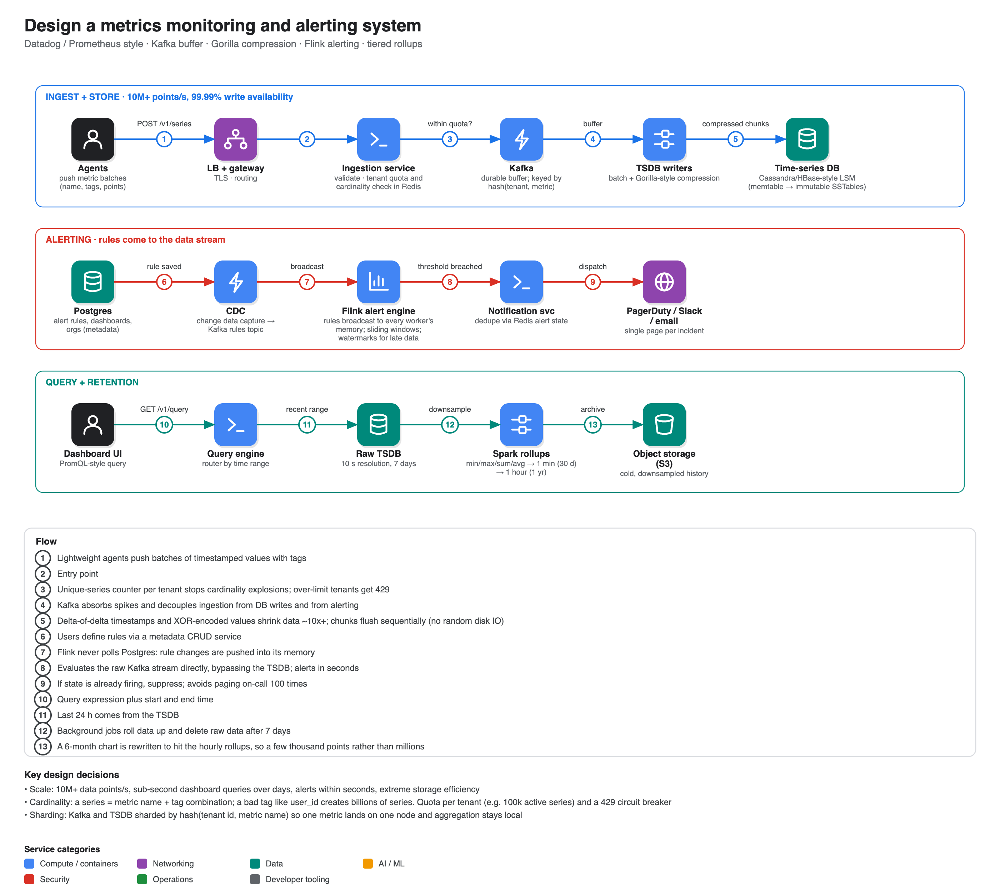

# Design a metrics monitoring and alerting system

**Source:** [Design Metrics Monitoring & Alerting System: System Design Interview](https://www.youtube.com/watch?v=T-8DgGQ7wUo) · TechPrep · ~22 min. Read from the transcript. For a different framing see Hello Interview's [Metrics Monitoring breakdown](https://www.hellointerview.com/learn/system-design/problem-breakdowns/metrics-monitoring) (Premium; only its requirements section is public: 500k servers × 100 metrics/10 s = ~5M metrics/s, ~1 GB/s, alerts under a minute, late/out-of-order data tolerated, high cardinality as a key risk).

## Requirements

- **Functional:** ingest infrastructure and application metrics with tags (CPU, latency; env=production, host=web01); build dashboards that query and aggregate over arbitrary time ranges; configure thresholds (e.g. CPU > 90% for 5 minutes); dispatch alerts to PagerDuty/Slack/email.
- **Non-functional:** **10M+ data points/s**; 99.99% availability on the ingestion path (dropping metrics during an incident blinds the customer); alerts in seconds; dashboards over days in < 1 s; strong compression and downsampling because data grows exponentially.

## Data model

| Store | Use |
|---|---|
| **Time-series DB** (Cassandra or custom HBase, built on an LSM tree) | Raw metrics; append-heavy, immutable. The presenter deliberately avoids an off-the-shelf TSDB such as InfluxDB so he can show the compression and storage internals |
| **Postgres** | Metadata: accounts, orgs, dashboards, alert rules (ACID) |
| **Redis** | Dashboard-query cache, ingestion rate limits and cardinality counters, last-known alert state |
| **Kafka** | Durable ingestion buffer; back-pressure absorber; decouples ingest from storage and alerting |
| **S3** | Cold storage for downsampled history |

## API

- `POST /v1/series`: batch of metrics (name, points of timestamp+value, tags).
- `GET /v1/query?query=…&start=…&end=…`: PromQL-style expression (e.g. average CPU for production by host); returns aggregated series.
- `POST /v1/alerts`: rule with query, threshold, evaluation window, notification targets.

## Architecture

1. Agents on customer infrastructure → load balancer/gateway (TLS) → **ingestion service**, which validates the payload and checks the tenant's quota/cardinality in Redis → **Kafka**.
2. **TSDB writers** consume batches from Kafka, compress and write sequentially to the TSDB.
3. **Spark** background jobs downsample old data and move it to S3.
4. **Flink** alert engine reads the same Kafka stream (not the TSDB) and keeps sliding windows in memory.
5. **Notification service** checks Redis alert state to avoid repeat pages, then calls external channels.
6. **Query engine** routes by time range: recent data from the TSDB, long ranges from rollups in S3.
7. **Metadata service** (CRUD) writes rules to Postgres; **CDC** on its transaction log pushes rule changes to Flink.

## Deep dives

### 1. Time-series storage and compression (Gorilla, from Facebook)

Raw 64-bit timestamps and floats at 10M points/s would be petabytes in days. Time series are predictable:

- **Delta-of-delta for timestamps.** Readings at fixed intervals have constant deltas (10, 10, 10, then 12), so the delta of deltas is 0, 0, 2…; zeros store as single bits. Keep one raw base timestamp.
- **XOR encoding for values.** Consecutive values differ little, so XOR with the previous float leaves leading and trailing zeros; store only the meaningful middle bits (and a repeat costs almost nothing).
- Together, about **10-12× compression**.
- **LSM tree / SSTables.** Compress chunks in a memtable, and when it fills (say 64 MB) flush sequentially as an immutable sorted file: no random disk IO, so disk keeps up with the network.

### 2. Real-time alerting

Querying the TSDB every 10 s for millions of rules would crush storage reads. Instead, **bring the rules to the stream**: Flink consumes Kafka, holds every active rule in worker memory (updated by CDC rather than polling Postgres), and keeps sliding windows (e.g. the last 5 minutes of CPU per host). **Watermarks** tell it when it's safe to finalise a window so a delayed packet doesn't falsely resolve an alert. When a threshold is crossed it emits a firing event; the notification service suppresses duplicates using Redis state per rule and host.

### 3. Downsampling and retention

10-second data is needed during an outage, not for a one-year chart. Spark computes min/max/sum/average rollups with tiered retention: raw 10 s for 7 days, 1-minute for 30 days, 1-hour for a year in S3. The query engine rewrites a six-month request to the hourly rollups, cutting millions of points to a few thousand.

### 4. Cardinality and sharding

A series is metric name + tag set. A mis-tagged service (user id or UUID on every request) creates billions of series and exhausts TSDB memory. Defences: shard Kafka and TSDB by `hash(tenant, metric name)` (so one metric lives on one node); Redis counters of unique series per tenant; a circuit breaker returning **429** when a tenant exceeds its contracted active series (e.g. 100k unique tag combinations), protecting everyone from the noisy neighbour.

## Notes

- Compare with Hello Interview's framing: alerts within a minute are sensible because many alerts are on moving averages; they also note some metrics (e.g. time since last order) can be designed to fire almost instantly.
- Related entries: [21 Ad click aggregator](../21-ad-click-aggregator/) (Flink windows, replay, reconciliation) and [18 Rate limiter](../18-rate-limiter/) (quota and 429).
