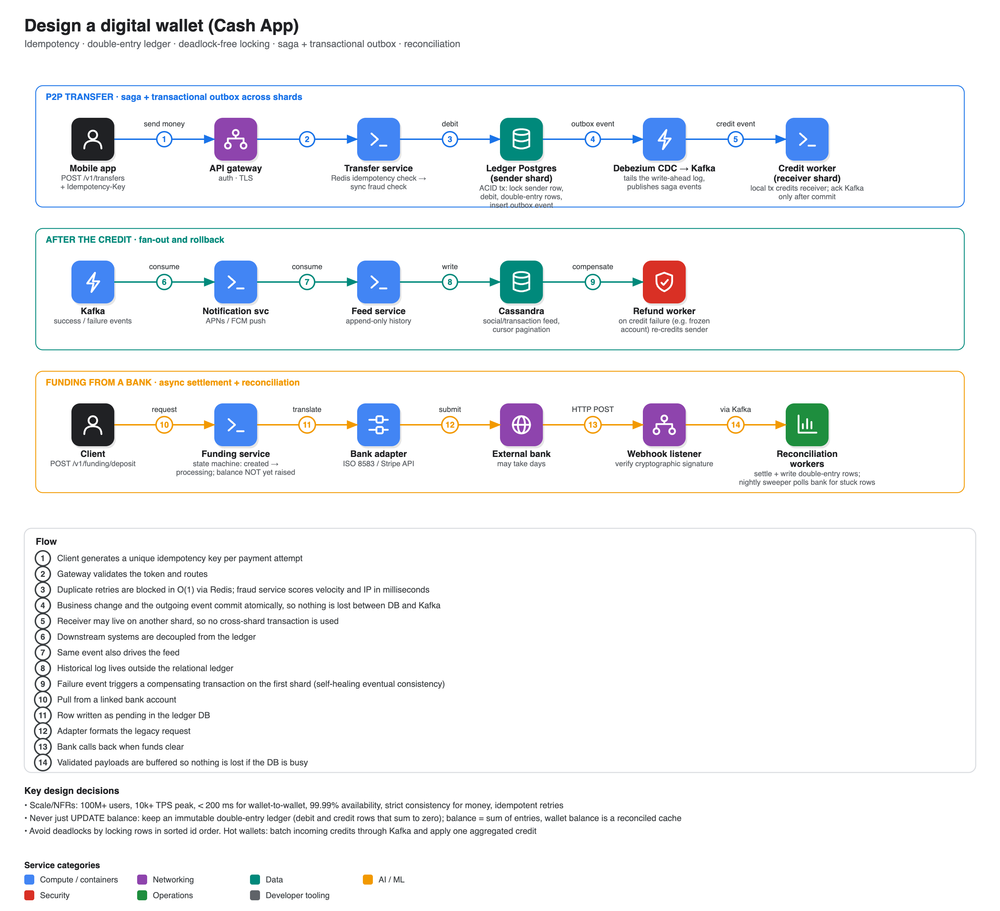

# Design a digital wallet (Cash App / PayPal style)

**Source:** [Design Cash App: System Design Interview](https://www.youtube.com/watch?v=lvseC9DYUvE) · TechPrep · ~20 min. Read from the transcript. For a Stripe-style merchant payment flow see Hello Interview's [Payment System breakdown](https://www.hellointerview.com/learn/system-design/problem-breakdowns/payment-system) (Premium; public outline only: initiate payment, pay by card, status updates; deep dives on security, durability/auditability, transaction safety against asynchronous payment networks, 10k+ TPS, webhooks).

## Requirements

- **Functional:** instant internal transfers between users; fund/withdraw via an external bank; balance inquiry; chronological transaction (social) feed.
- **Non-functional:** **strict consistency** (no lost or invented money; CP over AP for movements); **idempotency** (network retries must not double-move funds); 100M+ users and 10k+ TPS at peak; 99.99% availability; < 200 ms for internal transfers.

## Data model (polyglot persistence)

| Store | Use |
|---|---|
| **Relational DB (Postgres)** | Ledger source of truth with row-level locking. Tables: `users`, `wallets` (cached spendable balance reconciled with the ledger), `transfers` (state machine for internal and external movement), `outbox` (for the saga / CDC) |
| **Redis** | Idempotency keys blocked at the edge, rate limits, optional profile cache |
| **Kafka** | Durable event backbone decoupling the ledger from notifications, fraud and feeds |
| **Cassandra** | Append-only transaction history and social feed (chronological, cursor paging) |

## API

- `POST /v1/transfers` with headers `Idempotency-Key`, `Authorization`; body `{to_user, amount, currency, note}` → **201 Created** or **409 Conflict**.
- `POST /v1/funding/deposit`: starts an asynchronous pull from the external bank.
- `GET /v1/accounts/me/balance`; `GET /v1/feed?limit=20&cursor=…`.

## Two core flows

### Internal peer-to-peer transfer
1. The app attaches a unique idempotency key. Gateway authenticates and routes to the **transfer service** (the orchestrator).
2. It checks **Redis** for the key (O(1)) to drop duplicate retries, then synchronously asks the **fraud service** (IP and velocity rules) in milliseconds.
3. In the sender's **ledger** shard: one ACID transaction locks the sender's row, deducts the balance, writes double-entry rows, and inserts the "credit receiver" event into the **outbox table**.
4. **Debezium** (change data capture) detects the outbox row in the write-ahead log and publishes to **Kafka**.
5. Downstream consumers: notification service (APNs/FCM push) and feed service (Cassandra timeline).

### Funding from a bank (asynchronous)
1. Client → gateway → **funding service** writes a `pending` transfer; the spendable balance does **not** increase yet.
2. A **bank adapter** translates to the bank's format (ISO 8583 or a Stripe call) and submits it; clearing can take days.
3. The bank calls back an HTTP **webhook**, which verifies the cryptographic signature (to stop spoofed deposits) and posts to Kafka.
4. **Reconciliation workers** transition the transfer to `settled` and write ledger rows that raise the balance.

State machine: created → processing → settled or failed.

## Deep dives

1. **Immutable double-entry ledger.** `UPDATE wallet SET balance = balance - 50` is an anti-pattern (corruption leaves no proof of the balance). Money is never created or destroyed: every transfer writes at least two immutable rows sharing a transfer id that **sum to zero** (user A debit 50, user B credit 50). A balance is the sum of its entries; the wallet balance is a cached, reconcilable view.
2. **Deadlock prevention.** If A→B and B→A run concurrently and each locks its own row first, both wait forever. **Always lock in sorted id order** (lowest id first), so one thread waits and they run sequentially.
3. **Cross-shard transfers.** A DB transaction can't span shards, so replace distributed locks with the **saga pattern** and **transactional outbox**: the sender shard deducts and writes the outbox event in one commit; Debezium sends it to Kafka; a **credit worker** credits the receiver on its shard and acks the Kafka message only after its own commit (at-least-once). If the credit is rejected (frozen account), it emits a failure event and a **refund worker** compensates on the sender's shard. Trade-off: slow blocking transactions for highly available eventual consistency with guaranteed rollback.
4. **Asynchronous settlement and reconciliation.** Happy path via signed webhook. Failure path: a dropped webhook leaves a row stuck in `processing`, so a nightly sweeper selects transfers still processing after (say) three days, asks the bank's API for the definitive state, and settles them itself.

## Extra discussion points raised

- **Hot wallets** (a viral charity receives thousands of transfers at once): pessimistic locking on one row exhausts connections, so queue credits in Kafka and let a worker sum them and apply one aggregated credit (write combining).
- **Real-time fraud and AML:** stream interactions to Flink for risk scoring; load completed transactions into a graph DB (e.g. Neo4j) to detect smurfing (many small accounts funnelling to one node) and freeze wallets.
- **Offline payments (NFC/QR):** prefetch a batch of short-lived signed payment tokens into the device's secure enclave; the merchant forwards a token for asynchronous settlement.

## Related entries

[19 Ticketmaster](../19-ticketmaster/) (idempotent webhooks, refunds when a lock expires), [06 Google Ads](../06-google-ads/) (offset-based idempotency), [23 Job scheduler](../23-job-scheduler/) (at-least-once plus idempotency keys).
