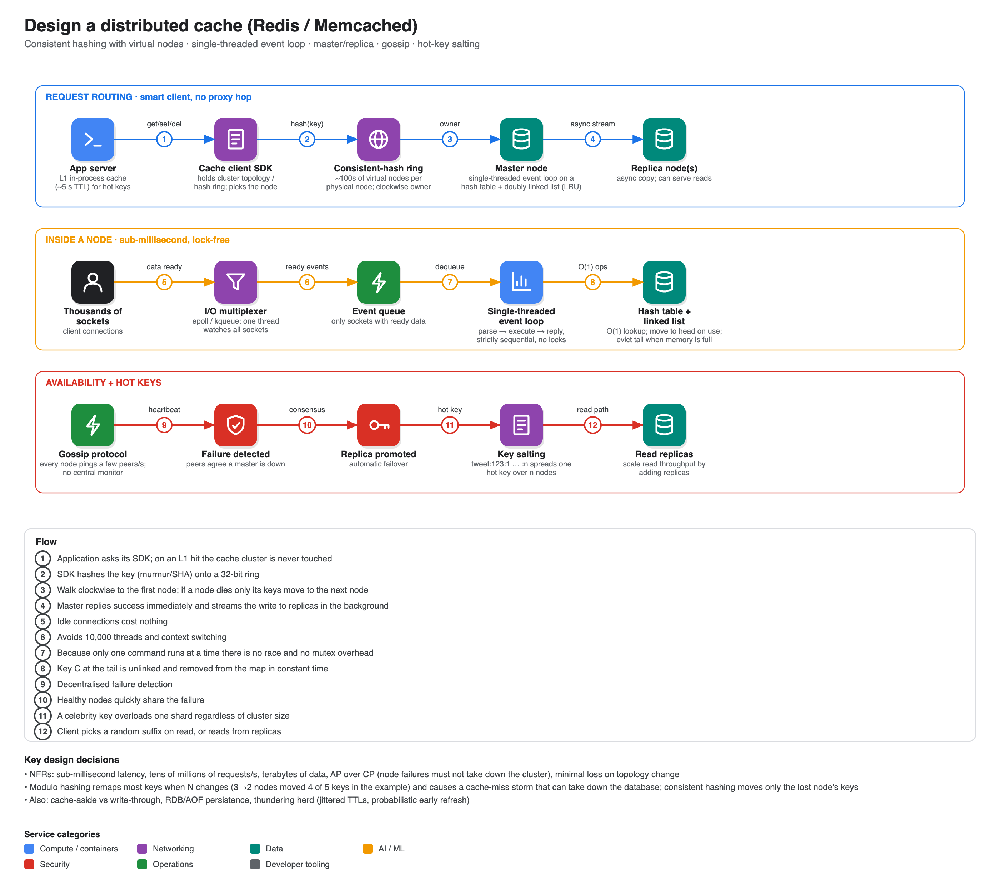

# Design a distributed cache (Redis / Memcached)

**Source:** [Distributed Cache (Redis): System Design Interview](https://www.youtube.com/watch?v=q7i31S4X8RU) · TechPrep · ~21 min. Read from the transcript. Hello Interview also has a [Distributed Cache breakdown](https://www.hellointerview.com/learn/system-design/problem-breakdowns/distributed-cache) (Premium; public outline only: set/get/delete, TTL, LRU, 1 TB and 100k requests/s peak, < 10 ms, hot-key reads and writes, performance).

## Requirements

- **Functional:** store a value against a key, retrieve by key, delete, support **TTL** and automatic **eviction** when memory is full.
- **Non-functional:** strictly **sub-millisecond** reads and writes; linear scaling to tens of millions of requests/s and terabytes; **high availability, AP in CAP terms** (a node failure must not take down the cluster); minimal data loss during topology changes.

## Core data structure

A **hash table** gives O(1) average lookup/insert/delete. Memory is finite, so combine it with a **doubly linked list** for **LRU**: accessing an item moves it to the head; when full, the tail is unlinked (O(1) because the list is doubly linked) and its key deleted from the hash map (O(1)).

## API

Typically a lightweight binary or custom TCP protocol (e.g. Redis's RESP), not HTTP: `GET key → value | null`, `SET key value [ttlSeconds]`, `DEL key`.

## High-level design

- An **application client** embeds a **cache client SDK**, a "smart router" holding the cluster topology that decides which node owns a key, avoiding an extra hop to a central proxy.
- **Cache nodes** are independent servers, each holding an in-memory hash table for a slice of the keys.
- The skeleton ignores failures and key placement, which the deep dives address.

## Deep dives

### 1. Partitioning: consistent hashing with virtual nodes

- **Modulo hashing** (`hash(key) mod N`) breaks when N changes: with keys 1-5 on 3 nodes, dropping to 2 nodes sent four of the five keys to the wrong node (80%), triggering a **cache-miss storm** that can crush the database the cache protects.
- **Consistent hashing:** hash both nodes (by IP) and keys onto a ring (a 32-bit space using e.g. murmur or SHA-256); a key belongs to the first node clockwise. When a node disappears, only its keys move to the next node; the rest of the cluster is unaffected. (An equivalent lookup uses a balanced BST to find the smallest node hash ≥ the key's hash.)
- **Virtual nodes:** a few physical nodes on a ring give uneven load and ignore differing capacities, so map each physical node to hundreds of virtual nodes (`A#1`, `A#2`, …). The hash function scatters near-identical names far apart, giving even distribution and balanced rebalancing.

### 2. Concurrency inside a node

Multi-threading with locks causes context switching and contention. The three-part answer (what Redis does):

1. **I/O multiplexing** (epoll on Linux, kqueue on macOS): one thread watches thousands of sockets and reports which are ready.
2. A **single-threaded event loop** dequeues ready events, parses the command, executes it against memory, and replies, strictly sequentially, hundreds of thousands of times a second. Scale out by adding nodes, not threads.
3. **Lock-free execution:** because only one command runs at a time, there is nothing to lock, so all CPU time goes to reading and writing data.

### 3. Availability

- **Master/replica topology** per partition: the master takes writes; replicas hold copies and take over on failure.
- **Asynchronous replication:** the master applies the write in RAM, answers the client at once, and streams to replicas in the background: millisecond responses, at the price of eventual consistency and a tiny risk of loss if the master dies before syncing, usually fine for a cache.
- **Gossip protocol:** every node pings a few random peers each second to exchange state; if a master stops responding, healthy nodes share the failure, agree, and **promote a replica** automatically, with no fragile central monitor.
- **Read replicas:** a single master can become a CPU bottleneck, so route read-only commands to replicas and scale reads by adding replicas.

### 4. Hot keys

A celebrity tweet makes millions request one key, overloading its shard regardless of cluster size. **Key salting**: store the value under `key:1 … key:n` so it lands on n nodes, and let clients pick a random suffix on read. Add an **L1 in-process cache** in each application server (a tiny, short TTL such as 5 s) so many requests never reach the cache network.

## Complete flows

- **Write (create profile for user 99):** load balancer → app server; SDK hashes `user99`, consults its ring copy, finds master B; sends SET over TCP; B's multiplexer flags it, the event loop writes to the hash table in O(1) and acknowledges, then streams to replica B in the background. Gossip continues independently.
- **Read:** app server checks L1; on a miss the SDK sends GET to replica B; the event loop returns the value; the app stores it in L1 with a short TTL and returns the HTTP response. Later reads for that key skip the cluster.

## Extra discussion points

- **Cache-aside vs write-through:** cache-aside has the app read the DB on a miss and populate the cache; write-through writes via the cache which synchronously updates the DB (slower writes, higher consistency).
- **Persistence:** Redis can snapshot to disk (RDB) or append to a log (AOF) to rebuild after a total power loss.
- **Thundering herd:** when a hot key expires, thousands of misses hit the database; add **TTL jitter** or **probabilistic early recomputation** to refresh before expiry.

## Related entries

[17 URL shortener](../17-url-shortener/) and [03 Spotify](../03-spotify/) (cache layers in practice), [18 Rate limiter](../18-rate-limiter/) (Redis sharding and Lua atomicity), [20 Web crawler](../20-web-crawler/).
